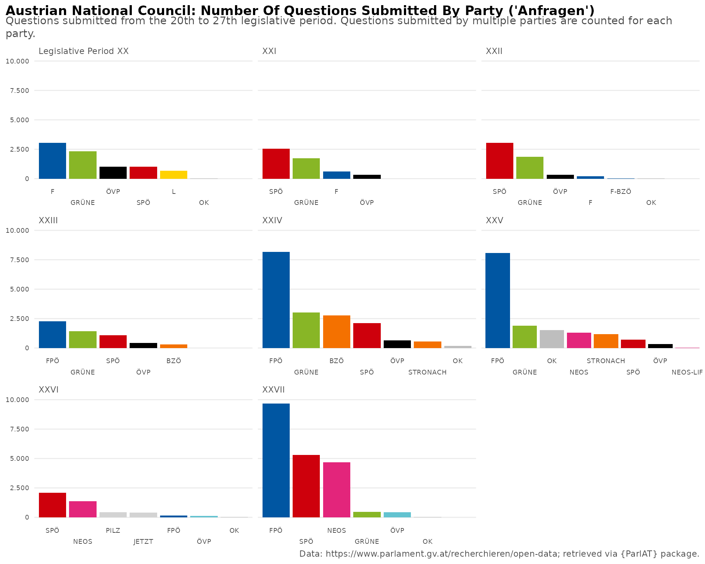
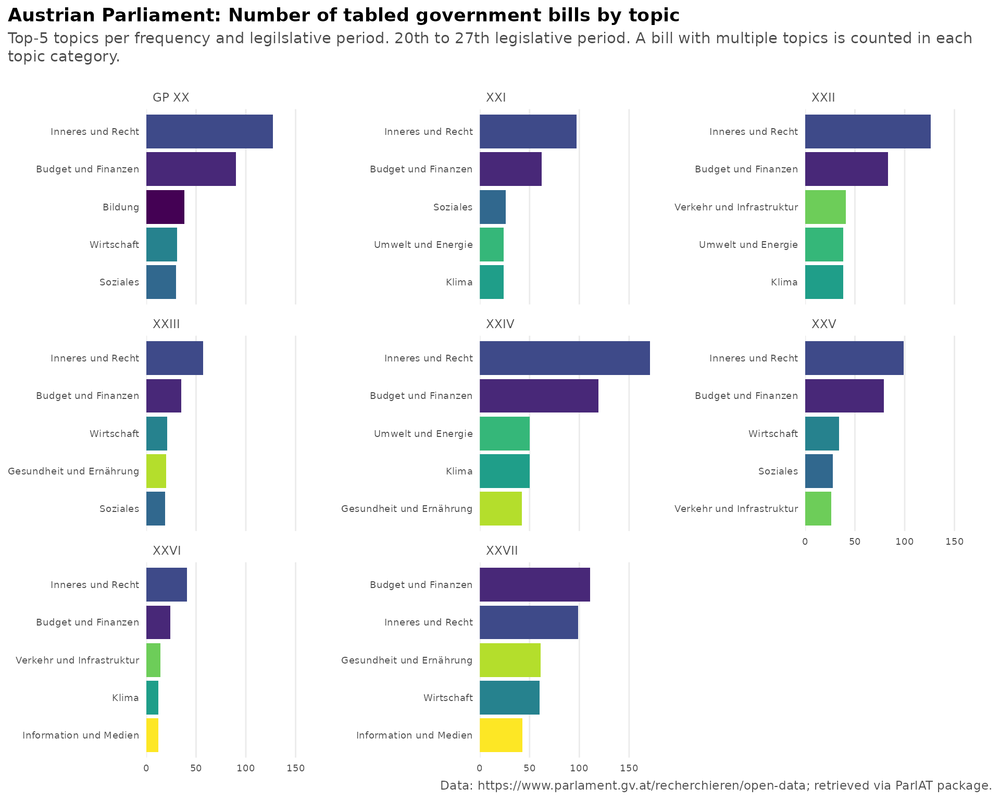
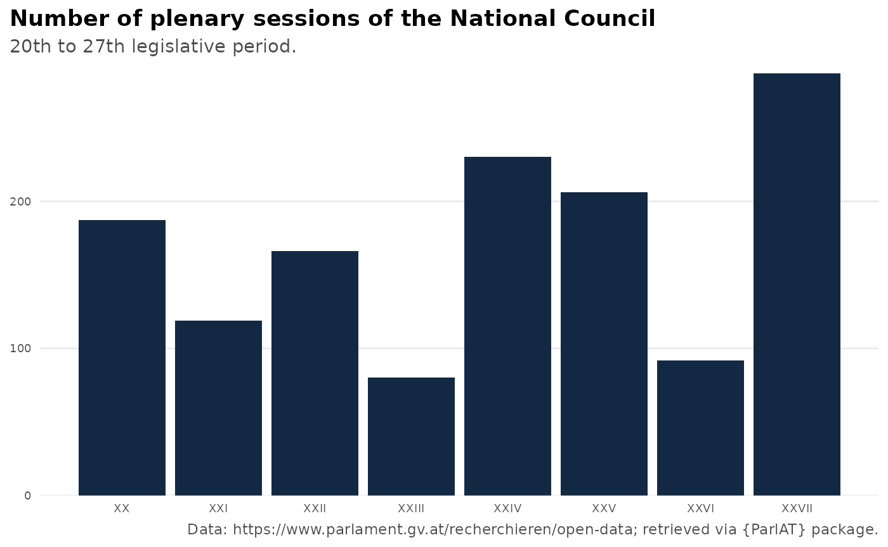

# ParlAT

This vignette provides an introduction on how to use the {ParlAT}
package to access and subseqently analyze open data provided by the
Austrian Parliament. Below are some examples which are meant to give a
general overview of the package’s functionality. For details, please
consult the [reference
section](https://werkstattcodes.github.io/ParlAT/reference/index.md).

## Get current MPs in the National Council (Nationalrat)

Let’s start with retrieving the compostion of the National Council
(Nationalrat) at the time of writing (18 December 2025). This is done by
the function
[`get_mps_current()`](https://werkstattcodes.github.io/ParlAT/reference/get_mps_current.md).

``` r
df_current <- get_mps_current(institution = "NR", echo=TRUE)
#> [1] 183
#> {"M":["M"],"W":["W"]} 
#> https://www.parlament.gv.at/recherchieren/personen/nationalrat/index.html?WFW_002M=M&WFW_002W=W
nrow(df_current)
#> [1] 183

df_current %>%
count(party, sort=T)
#> # A tibble: 5 × 2
#>   party     n
#>   <chr> <int>
#> 1 FPÖ      57
#> 2 ÖVP      51
#> 3 SPÖ      41
#> 4 NEOS     18
#> 5 Grüne    16
```

If we want to get the composition of a chamber in the past, the function
[`get_mps()`](https://werkstattcodes.github.io/ParlAT/reference/get_mps.md)
comes into play. It either returns all MPs of the requested chamber, who
formed part of it in the course of the entire legislative period
(`legis_period` argument), or at a specific date (`date` argument). The
latter is a convenient way to get the composition of the NR at a specifc
date.

Note that the `legis_period` filter is not applicable when searching MPs
of the Federal Council (Bundesrat). This limitation includes also
searches for MPs across all chambers.

``` r
#Search for all MPs in the National Council as of 1 January 2025
mps_01012025 <- get_mps(date="01.01.2025", institution="NR")
glimpse(mps_01012025)
#> Rows: 183
#> Columns: 6
#> Groups: pad_intern [183]
#> $ pad_intern   <int> 145, 1567, 1937, 1944, 1970, 1971, 1972, 1974, 1975, 1977, 1981, 1986, 1987, 2001, 2122, 2136, 2295, 2309, 2327, 2330, 2332, 2334, 2337, 2339, 2343, 2344, 2345, 2834, 2979, 2996, 2998, 3133, 3155, 3489, 3717, 5065, 5438, 5439, 5486, 5623, 5626, 5627, 5630, 5632, 5634, 5639, 5641, 5643, 5644, 5645, 5646, 5647, 5650, 5653, 5654, 5670, 5672, 5676, 5677, 5678, 5679, 5681, 5683, 5684, 5685, 5687, 6151, 6407, 6485, 6486, 6502, 6506, 8242, 10778, 12741, 14769, 14795, 14835, 14842, 14896, 16218, 16234, 20056, 20445, 22694, 22847, 23167, 23963, 25188, 30645, 30646, 30647, 30648, 30649, 30650, 30653, 30655, 30656, 30657, 30658, 30659, 30660, 30661, 30662, 30663, 30664, 30665, 30666, 30667, 30668, 30669, 30670, 30680, 30681, 30684, 30685, 30688, 30689, 30693, 30694, 30695, 30696, 30697, 30698, 30700, 30701, 30702, 30704, 30705, 30706, 30707, 30708, 30709, 30717, 30719, 30720, 30722, 30723, 30969, 31991, 35468, 35469, 35487, 35497, 35514, 35520, 35521, 35568, 36187, 47187, 51557, 51568, 51570, 51571, 51577, 52727, 55227, 61639, 64022, 65219, 67199, 72999, 78586, 80479, 83101, 83113, 83122, 83124, 83125, 83127, 83129, 83137, 83148, 83150, 83153, 83299, 83409, 84056, 86613, 87001, 87002, 87039, 91141
#> $ legis_period <chr> "XXVIII", "XXVIII", "XXVIII", "XXVIII", "XXVIII", "XXVIII", "XXVIII", "XXVIII", "XXVIII", "XXVIII", "XXVIII", "XXVIII", "XXVIII", "XXVIII", "XXVIII", "XXVIII", "XXVIII", "XXVIII", "XXVIII", "XXVIII", "XXVIII", "XXVIII", "XXVIII", "XXVIII", "XXVIII", "XXVIII", "XXVIII", "XXVIII", "XXVIII", "XXVIII", "XXVIII", "XXVIII", "XXVIII", "XXVIII", "XXVIII", "XXVIII", "XXVIII", "XXVIII", "XXVIII", "XXVIII", "XXVIII", "XXVIII", "XXVIII", "XXVIII", "XXVIII", "XXVIII", "XXVIII", "XXVIII", "XXVIII", "XXVIII", "XXVIII", "XXVIII", "XXVIII", "XXVIII", "XXVIII", "XXVIII", "XXVIII", "XXVIII", "XXVIII", "XXVIII", "XXVIII", "XXVIII", "XXVIII", "XXVIII", "XXVIII", "XXVIII", "XXVIII", "XXVIII", "XXVIII", "XXVIII", "XXVIII", "XXVIII", "XXVIII", "XXVIII", "XXVIII", "XXVIII", "XXVIII", "XXVIII", "XXVIII", "XXVIII", "XXVIII", "XXVIII", "XXVIII", "XXVIII", "XXVIII", "XXVIII", "XXVIII", "XXVIII", "XXVIII", "XXVIII", "XXVIII", "XXVIII", "XXVIII", "XXVIII", "XXVIII", "XXVIII", "XXVIII", "XXVIII", "XXVIII", "XXVIII", "XXVIII", "XXVIII", "XXVIII", "XXVIII", "XXVIII", "XXVIII", "XXVIII", "XXVIII", "XXVIII", "XXVIII", "XXVIII", "XXVIII", "XXVIII", "XXVIII", "XXVIII", "XXVIII", "XXVIII", "XXVIII", "XXVIII", "XXVIII", "XXVIII", "XXVIII", "XXVIII", "XXVIII", "XXVIII", "XXVIII", "XXVIII", "XXVIII", "XXVIII", "XXVIII", "XXVIII", "XXVIII", "XXVIII", "XXVIII", "XXVIII", "XXVIII", "XXVIII", "XXVIII", "XXVIII", "XXVIII", "XXVIII", "XXVIII", "XXVIII", "XXVIII", "XXVIII", "XXVIII", "XXVIII", "XXVIII", "XXVIII", "XXVIII", "XXVIII", "XXVIII", "XXVIII", "XXVIII", "XXVIII", "XXVIII", "XXVIII", "XXVIII", "XXVIII", "XXVIII", "XXVIII", "XXVIII", "XXVIII", "XXVIII", "XXVIII", "XXVIII", "XXVIII", "XXVIII", "XXVIII", "XXVIII", "XXVIII", "XXVIII", "XXVIII", "XXVIII", "XXVIII", "XXVIII", "XXVIII", "XXVIII", "XXVIII", "XXVIII", "XXVIII", "XXVIII", "XXVIII"
#> $ name         <chr> "Doris Bures", "Dr. Susanne Fürst", "Mag. Christian Ragger", "Peter Schmiedlechner", "Mag. Gerhard Kaniak", "Dipl.-Ing. Christian Schandor", "Dr. Markus Tschank", "Angela Baumgartner", "Mag. Dr. Juliane Bogner-Strauß", "Tanja Graf", "Mag. Carmen Jeitler-Cincelli, BA", "Dr. Gudrun Kugler", "Andreas Kühberger", "Ing. Klaus Lindinger, BSc", "Nico Marchetti", "Karl Nehammer, MSc", "Claudia Plakolm", "Eva-Maria Holzleitner, BSc", "Christoph Stark", "Robert Laimer", "Christoph Zarits", "Mag.<sup>a</sup> Verena Nussbaum", "Sabine Schatz", "Mag. Selma Yildirim", "Douglas Hoyos-Trauttmansdorff", "Dr. Stephanie Krisper", "Dr. Alma Zadić, LL.M.", "Mag. Dr. Martin Graf", "Mag. Karoline Edtstadler", "Ricarda Berger", "Alois Kainz", "MMst. Mag. (FH) Maria Neumann", "Andrea Michaela Schartel", "Christoph Steiner", "Ing. Mag. Volker Reifenberger", "MMag. Dr. Michael Schilchegger", "Lukas Brandweiner", "Dr. Christian Stocker", "Laurenz Pöttinger", "Ing. Josef Hechenberger", "Andreas Minnich", "Carina Reiter", "Mst. Joachim Schnabel", "MMag. Dr. Agnes Totter, BEd", "Bettina Zopf", "Julia Elisabeth Herr", "Maximilian Köllner, MA", "Mag.<sup>a</sup> Dr.<sup>in</sup> Petra Oberrauner", "Alois Schroll", "Michael Seemayer", "Rudolf Silvan", "Petra Tanzler", "Mag. Meri Disoski", "Leonore Gewessler, BA", "Dr. Elisabeth Götze", "Mag. Markus Koza", "Barbara Neßler", "Ralph Schallmeiner", "Mag. Dr. Jakob Schwarz, BA", "Mag. Nina Tomaselli", "Dipl.-Ing. Olga Voglauer", "Süleyman Zorba", "Henrike Brandstötter", "Fiona Fiedler, BEd", "Mag. Martina von Künsberg Sarre", "Mag. Yannick Shetty", "Heike Eder, BSc MBA", "Markus Leinfellner", "Mag. Klaudia Tanner", "MMag. Dr. Susanne Raab", "Mag. Agnes Sirkka Prammer", "Mag. Romana Deckenbacher", "Mag. Werner Kogler", "Mag. Norbert Totschnig, MSc", "Peter Haubner", "Norbert Sieber", "August Wöginger", "Petra Bayr, MA MLS", "Kai Jan Krainer", "Mag. Elisabeth Scheucher-Pichler", "Martina Diesner-Wais", "Mst. Johann Höfinger, MBA", "Mag. (FH) Kurt Egger", "Mag. Gerhard Karner", "Mag. Jörg Leichtfried", "Thomas Spalt", "Christian Oxonitsch", "Andreas Babler, MSc", "MMag. Michaela Schmidt", "Tina Angela Berger", "Irene Eisenhut", "Michael Fürtbauer", "Mag. Marie-Christine Giuliani-Sterrer, BA", "Mag. Paul Hammerl, MA", "Elisabeth Heiß", "Melanie Erasim, MSc", "Dr. Barbara Kolm", "Manuel Litzke, BSc (WU)", "Reinhold Maier", "Michael Oberlechner, MA", "MMag. Alexander Petschnig", "Manuel Pfeifer", "Mag. Katayun Pracher-Hilander", "Christofer Ranzmaier", "Mag. Arnold Schiefer", "Mag. Harald Schuh", "Nicole Sunitsch", "Ing. Harald Thau", "Maximilian Weinzierl", "Mag. Gertraud Auinger-Oberzaucher", "Veit Valentin Dengler", "Johannes Gasser, BA Bakk. MSc", "MMag. Markus Hofer", "Dominik Oberhofer", "Mag. Christoph Pramhofer", "Mag. Sophie Marie Wotschke", "Mag. Katrin Auer", "Roland Baumann", "Reinhold Binder", "Mag. Antonio Della Rossa", "Andreas Haitzer", "Mag. Elke Hanel-Torsch", "Bernhard Herzog", "Mag. Heinrich Himmer", "Bernhard Höfler", "Franz Jantscher", "Wolfgang Kocevar", "Silvia Kumpan-Takacs, MSc BA", "Wolfgang Moitzi", "Mag. Manfred Sams", "Paul Stich", "Barbara Teiber, MA", "MMag. Pia Maria Wieninger", "Margreth Falkner", "Daniela Gmeinbauer", "Mag. Dr. Wolfgang Hattmannsdorfer", "Klaus Mair", "Mag. Harald Servus", "Sebastian Schwaighofer", "Albert Royer", "Dr. Dagmar Belakowitsch", "Mag. Gernot Darmann", "Gabriel Obernosterer", "Josef Muchitsch", "Wolfgang Zanger", "Herbert Kickl", "Ing. Norbert Hofer", "Mag. Norbert Nemeth", "Wendelin Mölzer", "Werner Herbert", "Dipl.-Ing. Gerhard Deimek", "Christian Lausch", "Dr. Walter Rosenkranz", "Mag. Harald Stefan", "Maximilian Linder", "Johannes Schmuckenschlager", "Mag. Michael Hammer", "Hermann Brückl, MA", "Michael Schnedlitz", "Mag. Lukas Hammer", "Mag. Wolfgang Gerstl", "Mag. Klaus Fürlinger", "Christian Hafenecker, MA", "Mag. Karin Greiner", "Sigrid Maurer, BA", "Philip Kucher", "Mag. Beate Meinl-Reisinger, MES", "Michael Bernhard", "Dr. Nikolaus Scherak, MA", "MMag. DDr. Hubert Fuchs", "MMMag. Dr. Axel Kassegger", "Peter Wurm", "Mag. Andreas Hanger", "Andreas Ottenschläger", "Dipl.-Ing. Georg Strasser", "Ing. Manfred Hofinger", "Mag. Ernst Gödl", "Josef Schellhorn", "Mario Lindner", "David Stögmüller", "Rosa Ecker, MBA", "Lisa Schuch-Gubik", "Dipl.-Ing. Karin Doppelbauer"
#> $ gender       <chr> "female", "female", "male", "male", "male", "male", "male", "female", "female", "female", "female", "female", "male", "male", "male", "male", "female", "female", "male", "male", "male", "female", "female", "female", "male", "female", "female", "male", "female", "female", "male", "female", "female", "male", "male", "male", "male", "male", "male", "male", "male", "female", "male", "female", "female", "female", "male", "female", "male", "male", "male", "female", "female", "female", "female", "male", "female", "male", "male", "female", "female", "male", "female", "female", "female", "male", "female", "male", "female", "female", "female", "female", "male", "male", "male", "male", "male", "female", "male", "female", "female", "male", "male", "male", "male", "male", "male", "male", "female", "female", "female", "male", "female", "male", "female", "female", "female", "male", "male", "male", "male", "male", "female", "male", "male", "male", "female", "male", "male", "female", "male", "male", "male", "male", "male", "female", "female", "male", "male", "male", "male", "female", "male", "male", "male", "male", "male", "female", "male", "male", "male", "female", "female", "female", "female", "male", "male", "male", "male", "male", "female", "male", "male", "male", "male", "male", "male", "male", "male", "male", "male", "male", "male", "male", "male", "male", "male", "male", "male", "male", "male", "male", "male", "female", "female", "male", "female", "male", "male", "male", "male", "male", "male", "male", "male", "male", "male", "male", "male", "male", "female", "female", "female"
#> $ link         <chr> "/person/145", "/person/1567", "/person/1937", "/person/1944", "/person/1970", "/person/1971", "/person/1972", "/person/1974", "/person/1975", "/person/1977", "/person/1981", "/person/1986", "/person/1987", "/person/2001", "/person/2122", "/person/2136", "/person/2295", "/person/2309", "/person/2327", "/person/2330", "/person/2332", "/person/2334", "/person/2337", "/person/2339", "/person/2343", "/person/2344", "/person/2345", "/person/2834", "/person/2979", "/person/2996", "/person/2998", "/person/3133", "/person/3155", "/person/3489", "/person/3717", "/person/5065", "/person/5438", "/person/5439", "/person/5486", "/person/5623", "/person/5626", "/person/5627", "/person/5630", "/person/5632", "/person/5634", "/person/5639", "/person/5641", "/person/5643", "/person/5644", "/person/5645", "/person/5646", "/person/5647", "/person/5650", "/person/5653", "/person/5654", "/person/5670", "/person/5672", "/person/5676", "/person/5677", "/person/5678", "/person/5679", "/person/5681", "/person/5683", "/person/5684", "/person/5685", "/person/5687", "/person/6151", "/person/6407", "/person/6485", "/person/6486", "/person/6502", "/person/6506", "/person/8242", "/person/10778", "/person/12741", "/person/14769", "/person/14795", "/person/14835", "/person/14842", "/person/14896", "/person/16218", "/person/16234", "/person/20056", "/person/20445", "/person/22694", "/person/22847", "/person/23167", "/person/23963", "/person/25188", "/person/30645", "/person/30646", "/person/30647", "/person/30648", "/person/30649", "/person/30650", "/person/30653", "/person/30655", "/person/30656", "/person/30657", "/person/30658", "/person/30659", "/person/30660", "/person/30661", "/person/30662", "/person/30663", "/person/30664", "/person/30665", "/person/30666", "/person/30667", "/person/30668", "/person/30669", "/person/30670", "/person/30680", "/person/30681", "/person/30684", "/person/30685", "/person/30688", "/person/30689", "/person/30693", "/person/30694", "/person/30695", "/person/30696", "/person/30697", "/person/30698", "/person/30700", "/person/30701", "/person/30702", "/person/30704", "/person/30705", "/person/30706", "/person/30707", "/person/30708", "/person/30709", "/person/30717", "/person/30719", "/person/30720", "/person/30722", "/person/30723", "/person/30969", "/person/31991", "/person/35468", "/person/35469", "/person/35487", "/person/35497", "/person/35514", "/person/35520", "/person/35521", "/person/35568", "/person/36187", "/person/47187", "/person/51557", "/person/51568", "/person/51570", "/person/51571", "/person/51577", "/person/52727", "/person/55227", "/person/61639", "/person/64022", "/person/65219", "/person/67199", "/person/72999", "/person/78586", "/person/80479", "/person/83101", "/person/83113", "/person/83122", "/person/83124", "/person/83125", "/person/83127", "/person/83129", "/person/83137", "/person/83148", "/person/83150", "/person/83153", "/person/83299", "/person/83409", "/person/84056", "/person/86613", "/person/87001", "/person/87002", "/person/87039", "/person/91141"
#> $ mp_details   <list> [<tbl_df[1 x 12]>], [<tbl_df[1 x 12]>], [<tbl_df[1 x 12]>], [<tbl_df[1 x 12]>], [<tbl_df[1 x 12]>], [<tbl_df[1 x 12]>], [<tbl_df[1 x 12]>], [<tbl_df[1 x 12]>], [<tbl_df[1 x 12]>], [<tbl_df[1 x 12]>], [<tbl_df[1 x 12]>], [<tbl_df[1 x 12]>], [<tbl_df[1 x 12]>], [<tbl_df[1 x 12]>], [<tbl_df[1 x 12]>], [<tbl_df[1 x 12]>], [<tbl_df[1 x 12]>], [<tbl_df[1 x 12]>], [<tbl_df[1 x 12]>], [<tbl_df[1 x 12]>], [<tbl_df[1 x 12]>], [<tbl_df[1 x 12]>], [<tbl_df[1 x 12]>], [<tbl_df[1 x 12]>], [<tbl_df[1 x 12]>], [<tbl_df[1 x 12]>], [<tbl_df[1 x 12]>], [<tbl_df[1 x 12]>], [<tbl_df[1 x 12]>], [<tbl_df[1 x 12]>], [<tbl_df[1 x 12]>], [<tbl_df[1 x 12]>], [<tbl_df[1 x 12]>], [<tbl_df[1 x 12]>], [<tbl_df[1 x 12]>], [<tbl_df[1 x 12]>], [<tbl_df[1 x 12]>], [<tbl_df[1 x 12]>], [<tbl_df[1 x 12]>], [<tbl_df[1 x 12]>], [<tbl_df[1 x 12]>], [<tbl_df[1 x 12]>], [<tbl_df[1 x 12]>], [<tbl_df[1 x 12]>], [<tbl_df[1 x 12]>], [<tbl_df[1 x 12]>], [<tbl_df[1 x 12]>], [<tbl_df[1 x 12]>], [<tbl_df[1 x 12]>], [<tbl_df[1 x 12]>], [<tbl_df[1 x 12]>], [<tbl_df[1 x 12]>], [<tbl_df[1 x 12]>], [<tbl_df[1 x 12]>], [<tbl_df[1 x 12]>], [<tbl_df[1 x 12]>], [<tbl_df[1 x 12]>], [<tbl_df[1 x 12]>], [<tbl_df[1 x 12]>], [<tbl_df[1 x 12]>], [<tbl_df[1 x 12]>], [<tbl_df[1 x 12]>], [<tbl_df[1 x 12]>], [<tbl_df[1 x 12]>], [<tbl_df[1 x 12]>], [<tbl_df[1 x 12]>], [<tbl_df[1 x 12]>], [<tbl_df[1 x 12]>], [<tbl_df[1 x 12]>], [<tbl_df[1 x 12]>], [<tbl_df[1 x 12]>], [<tbl_df[1 x 12]>], [<tbl_df[1 x 12]>], [<tbl_df[1 x 12]>], [<tbl_df[1 x 12]>], [<tbl_df[1 x 12]>], [<tbl_df[1 x 12]>], [<tbl_df[1 x 12]>], [<tbl_df[1 x 12]>], [<tbl_df[1 x 12]>], [<tbl_df[1 x 12]>], [<tbl_df[1 x 12]>], [<tbl_df[1 x 12]>], [<tbl_df[1 x 12]>], [<tbl_df[1 x 12]>], [<tbl_df[1 x 12]>], [<tbl_df[1 x 12]>], [<tbl_df[1 x 12]>], [<tbl_df[1 x 12]>], [<tbl_df[1 x 12]>], [<tbl_df[1 x 12]>], [<tbl_df[1 x 12]>], [<tbl_df[1 x 12]>], [<tbl_df[1 x 12]>], [<tbl_df[1 x 12]>], [<tbl_df[1 x 12]>], [<tbl_df[1 x 12]>], [<tbl_df[1 x 12]>], [<tbl_df[1 x 12]>], [<tbl_df[1 x 12]>], [<tbl_df[1 x 12]>], [<tbl_df[1 x 12]>], [<tbl_df[1 x 12]>], [<tbl_df[1 x 12]>], [<tbl_df[1 x 12]>], [<tbl_df[1 x 12]>], [<tbl_df[1 x 12]>], [<tbl_df[1 x 12]>], [<tbl_df[1 x 12]>], [<tbl_df[1 x 12]>], [<tbl_df[1 x 12]>], [<tbl_df[1 x 12]>], [<tbl_df[1 x 12]>], [<tbl_df[1 x 12]>], [<tbl_df[1 x 12]>], [<tbl_df[1 x 12]>], [<tbl_df[1 x 12]>], [<tbl_df[1 x 12]>], [<tbl_df[1 x 12]>], [<tbl_df[1 x 12]>], [<tbl_df[1 x 12]>], [<tbl_df[1 x 12]>], [<tbl_df[1 x 12]>], [<tbl_df[1 x 12]>], [<tbl_df[1 x 12]>], [<tbl_df[1 x 12]>], [<tbl_df[1 x 12]>], [<tbl_df[1 x 12]>], [<tbl_df[1 x 12]>], [<tbl_df[1 x 12]>], [<tbl_df[1 x 12]>], [<tbl_df[1 x 12]>], [<tbl_df[1 x 12]>], [<tbl_df[1 x 12]>], [<tbl_df[1 x 12]>], [<tbl_df[1 x 12]>], [<tbl_df[1 x 12]>], [<tbl_df[1 x 12]>], [<tbl_df[1 x 12]>], [<tbl_df[1 x 12]>], [<tbl_df[1 x 12]>], [<tbl_df[1 x 12]>], [<tbl_df[1 x 12]>], [<tbl_df[1 x 12]>], [<tbl_df[1 x 12]>], [<tbl_df[1 x 12]>], [<tbl_df[1 x 12]>], [<tbl_df[1 x 12]>], [<tbl_df[1 x 12]>], [<tbl_df[1 x 12]>], [<tbl_df[1 x 12]>], [<tbl_df[1 x 12]>], [<tbl_df[1 x 12]>], [<tbl_df[1 x 12]>], [<tbl_df[1 x 12]>], [<tbl_df[1 x 12]>], [<tbl_df[1 x 12]>], [<tbl_df[1 x 12]>], [<tbl_df[1 x 12]>], [<tbl_df[1 x 12]>], [<tbl_df[1 x 12]>], [<tbl_df[1 x 12]>], [<tbl_df[1 x 12]>], [<tbl_df[1 x 12]>], [<tbl_df[1 x 12]>], [<tbl_df[1 x 12]>], [<tbl_df[1 x 12]>], [<tbl_df[1 x 12]>], [<tbl_df[1 x 12]>], [<tbl_df[1 x 12]>], [<tbl_df[1 x 12]>], [<tbl_df[1 x 12]>], [<tbl_df[1 x 12]>], [<tbl_df[1 x 12]>], [<tbl_df[1 x 12]>], [<tbl_df[1 x 12]>], [<tbl_df[1 x 12]>], [<tbl_df[1 x 12]>], [<tbl_df[1 x 12]>], [<tbl_df[1 x 12]>], [<tbl_df[1 x 12]>], [<tbl_df[1 x 12]>], [<tbl_df[1 x 12]>]
```

`get_mps` returns one row per MP and legislative period. The list column
`mp_details` contains details on an MPs mandate during the relevant
legislative period. Since such details can change over the course of a
legislative period (e.g. party affiliation, electoral list of the
mandate), unnesting `mp_details` may result in more than one row per MP.
The example below reveals the changing

``` r
#get all MPs of the 22th legislative peiod
mps_legis22 <- get_mps(legis_period=22, institution="NR")
#> {"ATTR_JSON.mandate_detail.gremium_name":["Nationalrat"],"ATTR_JSON.mandate_detail.gp_text_full_short":["20.12.2002 - 29.10.2006: XXII. GP"]} 
#> https://www.parlament.gv.at/recherchieren/personen/parlamentarierinnen-ab-1848/parlamentarierinnen-ab-1918?PERSON_409ATTR_JSON.mandate_detail.gremium_name=Nationalrat&PERSON_409ATTR_JSON.mandate_detail.gp_text_full_short=20.12.2002%20-%2029.10.2006:%20XXII.%20GP
#> [1] 209

#unnest details on their mandats
mps_legis22 <- mps_legis22  %>%
    tidyr::unnest(mp_details)

#Example Scheibner during the 22th legislative period
mps_legis22 %>%
    dplyr::filter(stringr::str_detect(name, "Scheibner"))
#> # A tibble: 2 × 17
#> # Groups:   pad_intern [1]
#>   pad_intern legis_period name              gender link         name_previous parl_group                                                         electoral_district_state electoral_district_region electoral_district_region_code chamber     chamber_code party                            party_code mandate_date_start mandate_date_end nrbr_praes
#>        <int> <chr>        <chr>             <chr>  <chr>        <chr>         <chr>                                                              <chr>                    <chr>                     <chr>                          <chr>       <chr>        <chr>                            <chr>      <date>             <date>           <list>    
#> 1       1604 XXII         Herbert Scheibner male   /person/1604 NA            Freiheitlicher Parlamentsklub; Freiheitlicher Parlamentsklub - BZÖ Wien                     Wien                      E9                             Nationalrat NR           Freiheitliche Partei Österreichs FPÖ        2006-04-28         2006-10-29       <NULL>    
#> 2       1604 XXII         Herbert Scheibner male   /person/1604 NA            Freiheitlicher Parlamentsklub; Freiheitlicher Parlamentsklub - BZÖ Wien                     Wien                      E9                             Nationalrat NR           Freiheitliche Partei Österreichs FPÖ        2002-12-20         2006-04-27       <NULL>
```

*Example Federal Council*

``` r
#Search for all MPs who were members of the Federal Council during the 25th legislative period:
#An error is returned since legis_period is no applicable filter for institution="BR".
df_mps_25_br <- get_mps(legis_period=25, institution="BR")
#> Error in get_mps(legis_period = 25, institution = "BR"): Filtering the Federal Council (Bundesrat) by legislative period is not supported. Please use 'date' filter instead.

#Get start and ending date of legislative period 25 with an auxilary function.
get_legis_periods(legis_period=25)
#>   legis_period_rom legis_period legis_period_current date_start   date_end                legis_period_name legis_period_abbrev legis_period_abbrev_num
#> 1              XXV           25                FALSE 2013-10-29 2017-11-08 29.10.2013 - 08.11.2017: XXV. GP                 XXV                      25

#Get members of the Federal Council as of 30 September 2013.
df_mps_25_br_date <- get_mps(date="30.10.2013", institution="BR")
nrow(df_mps_25_br_date)
#> [1] 60
```

## Get mandates

[`get_mandates()`](https://werkstattcodes.github.io/ParlAT/reference/get_mandates.md)
returns all current and previous mandates of one or more individuals.
The function takes names as well as unique identifiers (`pad_intern`) as
inputs, with the latter being the more specific option.

``` r
#Example with MP names:
get_mandates(name = c(
  "Karl Nehammer",
  "Andreas Babler"
))
#> # A tibble: 9 × 16
#>   pad_intern name                position_text                                                   position_code position_name                                                   position_date_start position_date_end position_active parl_group                                                                                                                                    wahlkreis                                                     party party_name                             electoral_district_region_code electoral_district_region                                     legis_period url_biography                           
#>   <chr>      <chr>               <chr>                                                           <chr>         <chr>                                                           <date>              <date>            <lgl>           <chr>                                                                                                                                         <chr>                                                         <chr> <chr>                                  <chr>                          <chr>                                                         <list>       <chr>                                   
#> 1 2136       Karl Nehammer, MSc  Abgeordneter zum Nationalrat (XXVIII. GP), ÖVP                  NR            Abgeordneter zum Nationalrat                                    2024-10-24          2025-01-21        FALSE           Parlamentsklub der Österreichischen Volkspartei                                                                                               Bundeswahlvorschlag                                           ÖVP   Österreichische Volkspartei            FB                             Bundeswahlvorschlag                                           <chr [1]>    https://www.parlament.gv.at/person/2136 
#> 2 2136       Karl Nehammer, MSc  Abgeordneter zum Nationalrat (XXVI.-XXVII. GP), ÖVP             NR            Abgeordneter zum Nationalrat                                    2017-11-09          2020-01-07        FALSE           Parlamentsklub der Österreichischen Volkspartei                                                                                               Bundeswahlvorschlag                                           ÖVP   Österreichische Volkspartei            FB                             Bundeswahlvorschlag                                           <chr [2]>    https://www.parlament.gv.at/person/2136 
#> 3 2136       Karl Nehammer, MSc  Bundeskanzler                                                   BK            Bundeskanzler                                                   2021-12-06          2025-01-10        FALSE           NA                                                                                                                                            NA                                                            NA    NA                                     NA                             NA                                                            <chr [0]>    https://www.parlament.gv.at/person/2136 
#> 4 2136       Karl Nehammer, MSc  Bundesminister für Inneres                                      BM            Bundesminister für Inneres                                      2020-01-07          2021-12-06        FALSE           NA                                                                                                                                            NA                                                            NA    NA                                     NA                             NA                                                            <chr [0]>    https://www.parlament.gv.at/person/2136 
#> 5 23963      Andreas Babler, MSc Abgeordneter zum Nationalrat (XXVIII. GP), SPÖ                  NR            Abgeordneter zum Nationalrat                                    2024-10-24          2025-03-06        FALSE           Die Sozialdemokratische Parlamentsfraktion - Klub der sozialdemokratischen Abgeordneten zum Nationalrat, Bundesrat und Europäischen Parlament Bundeswahlvorschlag                                           SPÖ   Sozialdemokratische Partei Österreichs FB                             Bundeswahlvorschlag                                           <chr [1]>    https://www.parlament.gv.at/person/23963
#> 6 23963      Andreas Babler, MSc Mitglied des Bundesrates, SPÖ                                   BR            Mitglied des Bundesrates                                        2023-03-23          2024-10-23        FALSE           Bundesratsfraktion der SPÖ                                                                                                                    In den Bundesrat entsendet vom Niederösterreichischen Landtag SPÖ   Sozialdemokratische Partei Österreichs In                             In den Bundesrat entsendet vom Niederösterreichischen Landtag <chr [0]>    https://www.parlament.gv.at/person/23963
#> 7 23963      Andreas Babler, MSc Bundesminister für Wohnen, Kunst, Kultur, Medien und Sport      BM            Bundesminister für Wohnen, Kunst, Kultur, Medien und Sport      2025-04-02          NA                TRUE            NA                                                                                                                                            NA                                                            NA    NA                                     NA                             NA                                                            <chr [0]>    https://www.parlament.gv.at/person/23963
#> 8 23963      Andreas Babler, MSc Bundesminister für Kunst, Kultur, öffentlichen Dienst und Sport BM            Bundesminister für Kunst, Kultur, öffentlichen Dienst und Sport 2025-03-03          2025-04-02        FALSE           NA                                                                                                                                            NA                                                            NA    NA                                     NA                             NA                                                            <chr [0]>    https://www.parlament.gv.at/person/23963
#> 9 23963      Andreas Babler, MSc Vizekanzler                                                     VK            Vizekanzler                                                     2025-03-03          NA                TRUE            NA                                                                                                                                            NA                                                            NA    NA                                     NA                             NA                                                            <chr [0]>    https://www.parlament.gv.at/person/23963

#Example with pad_intern and auxiliary function `get_pad_intern`.
get_pad_intern("Peter Pilz")
#> # A tibble: 1 × 2
#>   pad_intern names_variants
#>   <chr>      <chr>         
#> 1 1210       Peter Pilz
get_mandates(pad_intern=1210)
#> # A tibble: 5 × 16
#>   pad_intern name           position_text                                                  position_code position_name                position_date_start position_date_end position_active parl_group                                                                                                       wahlkreis                                 party party_name       electoral_district_region_code electoral_district_region                 legis_period url_biography                          
#>        <dbl> <chr>          <chr>                                                          <chr>         <chr>                        <date>              <date>            <lgl>           <chr>                                                                                                            <chr>                                     <chr> <chr>            <chr>                          <chr>                                     <list>       <chr>                                  
#> 1       1210 Dr. Peter Pilz Abgeordneter zum Nationalrat (XXVI. GP), JETZT                 NR            Abgeordneter zum Nationalrat 2018-11-20          2019-10-22        FALSE           Parlamentsklub JETZT                                                                                             Bundeswahlvorschlag                       JETZT Liste Peter Pilz FB                             Bundeswahlvorschlag                       <chr [1]>    https://www.parlament.gv.at/person/1210
#> 2       1210 Dr. Peter Pilz Abgeordneter zum Nationalrat (XXVI. GP), PILZ                  NR            Abgeordneter zum Nationalrat 2018-06-08          2018-11-19        FALSE           Liste Pilz                                                                                                       Bundeswahlvorschlag                       PILZ  Liste Peter Pilz FB                             Bundeswahlvorschlag                       <chr [1]>    https://www.parlament.gv.at/person/1210
#> 3       1210 Dr. Peter Pilz Abgeordneter zum Nationalrat (XXV. GP), ohne Klubzugehörigkeit NR            Abgeordneter zum Nationalrat 2017-07-17          2017-11-08        FALSE           ohne Klubzugehörigkeit                                                                                           Bundeswahlvorschlag                       OK    Die Grünen       FB                             Bundeswahlvorschlag                       <chr [1]>    https://www.parlament.gv.at/person/1210
#> 4       1210 Dr. Peter Pilz Abgeordneter zum Nationalrat (XXI.-XXV. GP), GRÜNE             NR            Abgeordneter zum Nationalrat 1999-10-29          2017-07-16        FALSE           Der Grüne Klub im Parlament - Klub der Grünen Abgeordneten zum Nationalrat, Bundesrat und Europäischen Parlament Bundeswahlvorschlag                       GRÜNE Die Grünen       FB                             Bundeswahlvorschlag                       <chr [2]>    https://www.parlament.gv.at/person/1210
#> 5       1210 Dr. Peter Pilz Abgeordneter zum Nationalrat (XVII.-XVIII. GP), GRÜNE          NR            Abgeordneter zum Nationalrat 1986-12-17          1991-12-08        FALSE           Der Grüne Klub - Klub der Grün-Alternativen Abgeordneten                                                         Wahlkreisverband II (K, OÖ, S, St, T u V) GRÜNE Die Grünen       Wahlkreisverband               Wahlkreisverband II (K, OÖ, S, St, T u V) <chr [2]>    https://www.parlament.gv.at/person/1210
```

The function `get_mandates` also allows us to relatively easily
calcualte the total number of days which the current MPs in the National
Council have been serving as of now, and identify the longest serving
MPs (top 5 are shown below).

``` r
df_mandates <- get_mandates(pad_intern=df_current$pad_intern, institution = "NR")

#keep only MP mandates in the National Council (NR); `instituiton` refers only to the 
#current position, not the preceding mandates.
df_mandates <- df_mandates %>%
    filter(position_code == "NR") 
  
df_mandates <- df_mandates %>%
mutate(position_date_end=case_when(
  is.na(position_date_end) & position_active==TRUE ~ lubridate::today(),
  .default=position_date_end
)) %>%
mutate(position_duration_days = as.numeric(difftime(position_date_end, position_date_start, units = "days")),
.after=position_date_end)

duration <- df_mandates %>%
summarise(position_days_sum=sum(position_duration_days), .by=c("pad_intern", "name")) %>%
arrange(desc(position_days_sum))

duration %>%
slice_head(., n=5)
#> # A tibble: 5 × 3
#>   pad_intern name                 position_days_sum
#>   <chr>      <chr>                            <dbl>
#> 1 145        Doris Bures                      10240
#> 2 12741      Peter Haubner                     8781
#> 3 2834       Mag. Dr. Martin Graf              8480
#> 4 14835      Petra Bayr, MA MLS                8399
#> 5 14795      August Wöginger                   8399
```

## Get MPs’ details

If we are interested in the work of a specific MP, the fucntion
[`get_mps_details()`](https://werkstattcodes.github.io/ParlAT/reference/get_mps_details.md)
is the tool of choice. There are three detail types which can be quried:
“plenary” (Plenum), “committee” (Ausschüsse), and “activities”
(Aktivitäten).

For a start, let’s get a list of all speeches held in the plenary by MP
Karlheinz Kopf. To get his required pad_intern, we can resort to the
auxilary function ‘get_pad_intern()’ which returns the MP’s unique
identifier.

``` r
#get pad_intern of Karlheinz Kopf
get_pad_intern("Karlheinz Kopf")
#> # A tibble: 1 × 2
#>   pad_intern names_variants
#>   <chr>      <chr>         
#> 1 2822       Karlheinz Kopf

#get all statements held in the plenary of the National Council by Karlheinz Kopf
df_plenary_kopf <- get_mps_details(pad_intern=2822, detail_type="plenary", institution = "NR")
#> {"PAD_INTERN":[2822],"GREMIUM":["N"]} 
#> https://www.parlament.gv.at/person/2822?BIO_250PAD_INTERN=2822&BIO_250GREMIUM=N&selectedtab=PLENUM
#> [1] 380


df_plenary_kopf %>%
  count(legis_period) %>%
  arrange(legis_period)
#> # A tibble: 9 × 2
#>   legis_period     n
#>   <chr>        <int>
#> 1 XIX              1
#> 2 XX              62
#> 3 XXI             44
#> 4 XXII            56
#> 5 XXIII           26
#> 6 XXIV           105
#> 7 XXV              4
#> 8 XXVI            18
#> 9 XXVII           64
```

Note that `get_mps_details` returns all activites, speeches even if the
individual was member of the government bench or member of the houses
presidency at this point in time. The column `position_name` is a list
column containing all mandates the indiviudal held *in the relevant
house* at the time of the plenary statement.

``` r
#Example Sebastian Kurz: statements held by Sebastian Kurz in the plenary of the National Council.
#Note different positions.

get_pad_intern("Sebastian Kurz")
#> # A tibble: 1 × 2
#>   pad_intern names_variants
#>   <chr>      <chr>         
#> 1 65321      Sebastian Kurz

df_plenary_kurz <- get_mps_details(pad_intern=65321, detail_type="plenary", institution = "NR") 
#> {"PAD_INTERN":[65321],"GREMIUM":["N"]} 
#> https://www.parlament.gv.at/person/65321?BIO_250PAD_INTERN=65321&BIO_250GREMIUM=N&selectedtab=PLENUM
#> [1] 76

df_plenary_kurz %>%
unnest(position_name) %>%
count(position_name, sort=TRUE)
#> # A tibble: 5 × 2
#>   position_name                                                         n
#>   <chr>                                                             <int>
#> 1 Bundeskanzler                                                        41
#> 2 Bundesminister für Europa, Integration und Äußeres                   25
#> 3 Staatssekretär im Bundesministerium für Inneres                       6
#> 4 Abgeordneter zum Nationalrat                                          5
#> 5 Bundesminister für europäische und internationale Angelegenheiten     1
```

## Items under consideration (‘Verhandlungsgegenstände’)

The ability to search for different items under consideration is
probably one of the most encompassing features offered by the Open Data
repository of the Austrian Parliament (see
[here](https://www.parlament.gv.at/recherchieren/gegenstaende/index.html?FP_001NRBR=NR)).
The items which can be queried comprise a wide range including Topical
Debates (*Aktuelle Stunden*), Inquiries (*Anfragen*), Government Bills
(*Regierungsvorlagen*) etc. All items can be accessed via the general
[`get_items()`](https://werkstattcodes.github.io/ParlAT/reference/get_items.md)
function. For a full list of available items see
[here](https://werkstattcodes.github.io/ParlAT/reference/get_items.html#item-gegenstand-).

For some of these items, additional parameter(s) are available to
further specifiy the query. E.g. the item “ANTR” (Anträge, Motions)
allows for the specification of the type of motion via the `type_doc`
attribute. For details see the reference section
[here](https://werkstattcodes.github.io/ParlAT/reference/get_items.html#doc-type-art-des-antrages-).

*Example: Inquiries (Anfragen)*

Below, as an example, let’s query all written and oral questions
(*Anfragen*) from the 20 to the 27 legislative period (for the relevant
item abbreviations see the function reference), and subsequently
visualise the count by party and legislative period.

``` r
#get items
df_items <- get_items(item = "J_JPR_M", legis_period = seq(20,27), echo=TRUE)
#> {"GP_CODE":["XX","XXI","XXII","XXIII","XXIV","XXV","XXVI","XXVII"],"VHG":["J_JPR_M"]} 
#> https://www.parlament.gv.at/recherchieren/gegenstaende/index.html?FP_001GP_CODE=XX&FP_001GP_CODE=XXI&FP_001GP_CODE=XXII&FP_001GP_CODE=XXIII&FP_001GP_CODE=XXIV&FP_001GP_CODE=XXV&FP_001GP_CODE=XXVI&FP_001GP_CODE=XXVII&FP_001VHG=J_JPR_M
#> [1] 77208


dplyr::glimpse(df_items %>% head())
#> Rows: 6
#> Columns: 16
#> $ legis_period     <chr> "XXVII", "XXVII", "XXVII", "XXVII", "XXVII", "XXVII"
#> $ institution      <chr> "NR", "NR", "NR", "NR", "NR", "NR"
#> $ date             <date> 2022-12-07, 2021-03-22, 2021-03-22, 2021-04-19, 2021-03-23, 2021-03-23
#> $ item_type        <chr> "M", "M", "M", "M", "M", "M"
#> $ item_number      <chr> "212", "45", "51", "67", "62", "63"
#> $ item_number_type <chr> "212/M", "45/M", "51/M", "67/M", "62/M", "63/M"
#> $ stage            <chr> "5", "5", "5", "5", "5", "5"
#> $ item_url         <chr> "/gegenstand/XXVII/M/212", "/gegenstand/XXVII/M/45", "/gegenstand/XXVII/M/51", "/gegenstand/XXVII/M/67", "/gegenstand/XXVII/M/62", "/gegenstand/XXVII/M/63"
#> $ type_doc         <chr> "M", "M", "M", "M", "M", "M"
#> $ type_doc_long    <chr> "Mündliche Anfrage", "Mündliche Anfrage", "Mündliche Anfrage", "Mündliche Anfrage", "Mündliche Anfrage", "Mündliche Anfrage"
#> $ subject          <chr> "aktuelle Situation in der Ukraine", "Bundes-Sportförderung", "Vorkehrungen für die Kunst- und Kulturszene in der Corona-Krise 2021", "Arbeitsmarktsituation im Tourismus", "Aufwertung des Themas Humanitäre Hilfe in der österreichischen Entwicklungszusammenarbeit", "Projekt Nord Stream 2"
#> $ topics           <list> "Außenpolitik", "Sport", <"Gesundheit und Ernährung", "Kultur">, "Wirtschaft", "Außenpolitik", <"Klima", "Umwelt und Energie">
#> $ keywords         <list> "Außenpolitik", "Sport", <"Kunst und Kultur", "Gesundheit">, "Fremdenverkehr", "Entwicklungszusammenarbeit", "Energiewirtschaft"
#> $ eurovoc          <list> "Internationale Beziehungen", "Sport", <"Gesundheit", "Kulturpolitik", "Kunst">, "Tourismus", "Politik der Zusammenarbeit", "Energie"
#> $ persons          <list> <"2979", "67199", "83114", "87146">, <"5438", "6502", "8242">, <"1978", "8242">, <"1984", "5638", "5672", "18140", "35515", "84056">, <"3716", "5430", "5683", "14844", "84054">, <"1937", "5430", "22694">
#> $ parl_group       <list> <"ÖVP", "ÖVP", "SPÖ", "GRÜNE">, <"ÖVP", "GRÜNE", "GRÜNE">, <"ÖVP", "GRÜNE">, <"ÖVP", "SPÖ", "GRÜNE", "OK", "FPÖ", "NEOS">, <"ÖVP", "OK", "NEOS", "SPÖ", "GRÜNE">, <"FPÖ", "OK", "SPÖ">
```

There were in total 77 208 questions submitted in writing and asked
orally by the members of the National Council from the 20th to 27th
legislative period. With a few additional steps, we can easily visualise
the results.

``` r
# Create color mapping for Austrian political parties
party_colors <- c(
  "SPÖ" = "#CE000C",
  "ÖVP" = "#63C3D0",
  "FPÖ" = "#0056A2",
  "F" = "#0056A2",
  "F-BZÖ" = "#0056A2",
  "GRÜNE" = "#88B626",
  "NEOS" = "#E3257B",
  "NEOS/NEOS-LIF" = "#E3257B",
  "Grüne" = "#88B626",
  "STRONACH" = "#F47100",
  "BZÖ" = "#F47100",
  "LIF" = "#FFD200",
  "L" = "#FFD200",
  "FRANK" = "#800080",
  "JETZT/PILZ"="lightgrey",
  "OK" ="grey"
)

#aggregate result; account for chaning ÖVP party colors
df_plot <- df_items %>%
  unnest_longer(parl_group) %>%
  count(legis_period, parl_group) %>%
  mutate(
    parl_group_color = case_when(
      parl_group == "ÖVP" & as.numeric(legis_period) < 26 ~ "black",
      parl_group == "ÖVP" & as.numeric(legis_period) >= 26 ~ "#63C3D0",
      TRUE ~ party_colors[parl_group]
    )
  )  
#> Warning: There were 2 warnings in `mutate()`.
#> The first warning was:
#> ℹ In argument: `parl_group_color = case_when(...)`.
#> Caused by warning:
#> ! NAs introduced by coercion
#> ℹ Run `dplyr::last_dplyr_warnings()` to see the 1 remaining warning.

#plot
df_plot %>%
  ggplot()+
  labs(
    title = stringr::str_to_title("Austrian National Council: Number of questions submitted by party ('Anfragen')"),
    subtitle = "Questions submitted from the 20th to 27th legislative period. Questions submitted by multiple parties are counted for each party.",
    caption = "Data: https://www.parlament.gv.at/recherchieren/open-data; retrieved via {ParlAT} package."
  )+
  geom_bar(aes(x=tidytext::reorder_within(parl_group, -n, legis_period), y=n, fill=parl_group_color), stat="identity")+ 
  scale_x_reordered(guide = guide_axis(n.dodge = 2), continuous.limits=c(1,7))+
  scale_y_continuous(labels=scales::label_number(big.mark = ".", decimal.mark = ","))+  
  scale_fill_identity()+
  facet_wrap(vars(legis_period), scales = "free_x", labeller = labeller(legis_period = function(x) ifelse(x == min(x), paste("Legislative Period", x), x)))+ 
  theme_minimal()+
  theme(
    strip.text.x= element_text(face = "plain", hjust = 0,color="grey30"),
    panel.grid.minor =  element_blank(),
    panel.grid.major.x=  element_blank(),
    legend.position = "none",
    axis.title.x = element_blank(),
    axis.text.x=element_text(size=rel(0.8)),
    axis.text.y=element_text(size=rel(0.8)),
    axis.title.y=element_blank(),
    plot.caption = element_text(color="grey30", size=rel(.8)),
    plot.subtitle=ggtext::element_textbox_simple(color="grey30", margin = ggplot2::margin(b = 10)),
    plot.title.position = "plot",
    plot.title = element_text(face = "bold")
  )
```



*Example: Government Bills (“Regierungsvorlagen”)*

As another example to demonstrate the power of the
[`get_items()`](https://werkstattcodes.github.io/ParlAT/reference/get_items.md)
function, let’s get the number of government bills tabled from the 20th
to the 27th legislative period and count them. Furthermore, making use
of the `topic` column, which is returned by the API, one can easily
differentiate between the bills’ various topical foci and obtain the
pertaining subtotals.

``` r
df_govBills <- get_items(item = "RV", legis_period = seq(20,27)) 
#> {"GP_CODE":["XX","XXI","XXII","XXIII","XXIV","XXV","XXVI","XXVII"],"VHG":["RV"]} 
#> https://www.parlament.gv.at/recherchieren/gegenstaende/index.html?FP_001GP_CODE=XX&FP_001GP_CODE=XXI&FP_001GP_CODE=XXII&FP_001GP_CODE=XXIII&FP_001GP_CODE=XXIV&FP_001GP_CODE=XXV&FP_001GP_CODE=XXVI&FP_001GP_CODE=XXVII&FP_001VHG=RV
#> [1] 2593

glimpse(df_govBills %>% head())
#> Rows: 6
#> Columns: 16
#> $ legis_period     <chr> "XXVII", "XXVII", "XXVII", "XXVII", "XXVII", "XXVII"
#> $ institution      <chr> "NR", "NR", "NR", "NR", "NR", "NR"
#> $ date             <date> 2021-05-12, 2021-05-12, 2021-03-17, 2020-11-18, 2021-01-13, 2021-03-24
#> $ item_type        <chr> "I", "I", "I", "I", "I", "I"
#> $ item_number      <chr> "849", "850", "733", "470", "630", "769"
#> $ item_number_type <chr> "849 d.B.", "850 d.B.", "733 d.B.", "470 d.B.", "630 d.B.", "769 d.B."
#> $ stage            <chr> "5", "5", "5", "5", "5", "5"
#> $ item_url         <chr> "/gegenstand/XXVII/I/849", "/gegenstand/XXVII/I/850", "/gegenstand/XXVII/I/733", "/gegenstand/XXVII/I/470", "/gegenstand/XXVII/I/630", "/gegenstand/XXVII/I/769"
#> $ type_doc         <chr> "RV", "RV", "RV", "RV", "RV", "RV"
#> $ type_doc_long    <chr> "Regierungsvorlage: Bundes(verfassungs)gesetz", "Regierungsvorlage: Bundes(verfassungs)gesetz", "Regierungsvorlage: Bundes(verfassungs)gesetz", "Regierungsvorlage: Bundes(verfassungs)gesetz", "Regierungsvorlage: Bundes(verfassungs)gesetz", "Regierungsvorlage: Bundes(verfassungs)gesetz"
#> $ subject          <chr> "Terror-Bekämpfungs-Gesetz – TeBG", "Bundesgesetz über die Rechtspersönlichkeit von religiösen Bekenntnisgemeinschaften, Islamgesetz, Änderung", "Erneuerbaren-Ausbau-Gesetzespaket – EAG-Paket", "Eisenbahngesetz, Unfalluntersuchungsgesetz, Änderung", "Finanzausgleichsgesetz, Einkommensteuergesetz u.a., Änderung", "Gerichtsorganisationsgesetz, Bundesverwaltungsgerichtsgesetz u.a., Änderung"
#> $ topics           <list> "Inneres und Recht", "Kultur", <"Inneres und Recht", "Klima", "Umwelt und Energie">, "Verkehr und Infrastruktur", "Budget und Finanzen", "Inneres und Recht"
#> $ keywords         <list> <"Sicherheitswesen", "Strafrecht">, "Religion", <"Bundesverfassung", "Energiewirtschaft", "Elektrizität", "Umweltschutz">, "Verkehr II. Schienenverkehr", <"Finanzausgleich", "Steuern und Gebühren">, <"Rechtspflege", "Verfassungs- und Verwaltungsgerichtsbarkeit">
#> $ eurovoc          <list> <"öffentliche Sicherheit", "Strafrecht">, "Religion", <"Elektrizitätsindustrie", "Energie", "Umwelt", "Verfassung">, "Schienentransport", <"Finanzausgleich", "Steuerwesen">, <"Gerichtswesen", "Verfassungsgerichtsbarkeit", "Verwaltungsgerichtsbarkeit">
#> $ persons          <list> "", "", "", "", "", ""
#> $ parl_group       <list> <"null", "null">, <"null", "null">, <"null", "null">, <"null", "null">, <"null", "null">, <"null", "null">

#count number of bills by legis period
df_govBills %>%
count(legis_period, name = "n") 
#>   legis_period   n
#> 1           XX 443
#> 2          XXI 291
#> 3         XXII 374
#> 4        XXIII 176
#> 5         XXIV 496
#> 6          XXV 331
#> 7         XXVI 117
#> 8        XXVII 365

df_govBillsTopicsTop5 <- df_govBills %>%
unnest_longer(topics) %>%
group_by(legis_period) %>%
mutate(topics=forcats::fct_lump_n(topics, n = 5, ties.method = "first")) %>%
ungroup() %>%
count(legis_period, topics)

df_govBillsTopicsTop5 %>%
filter(topics!="Other") %>%
ggplot()+
labs(
  title="Austrian Parliament: Number of tabled government bills by topic",
  subtitle="Top-5 topics per frequency and legilslative period. 20th to 27th legislative period. A bill with multiple topics is counted in \neach topic category.",
  caption = "Data: https://www.parlament.gv.at/recherchieren/open-data; retrieved via ParlAT package."
)+ 
geom_bar(
  aes(y=tidytext::reorder_within(topics, n, legis_period), 
  x=n,
  fill=topics),
  stat="identity")+
scale_y_reordered()+
scale_x_continuous(
  expand=expansion(mult=c(0,.1))
)+
scale_fill_viridis_d()+
facet_wrap(
  vars(legis_period), 
  labeller = labeller(legis_period = function(value) ifelse(value == min(value), paste("GP", value), value)),
  scales="free_y")+
theme_minimal()+
theme(
    strip.text.x= element_text(face = "plain", hjust = 0, color="grey30"),
    panel.grid.minor =  element_blank(),
    panel.grid.major.y=  element_blank(),
    legend.position = "none",
    axis.title.x = element_blank(),
    axis.text.x=element_text(size=rel(0.8)),
    axis.text.y=element_text(size=rel(0.8)),
    axis.title.y=element_blank(),
    plot.caption = element_text(color="grey30"),
    plot.subtitle=ggtext::element_textbox_simple(color="grey30", margin = ggplot2::margin(b = 15)),
    plot.title.position = "plot",
    plot.title = element_text(face = "bold")
  )
```



*Example: Popular Initiatives (“Volksbegehren”)*

Get the number of popular initiatives (“Volksbegehren”) which were
considered - in different stages - by the Austrian National Counil from
the 20th to the 27th legislative period and count them per legislative
period.

``` r
df_petition <- get_items(item = "VOLKBG", legis_period = seq(20, 27), institution = "NR", echo = TRUE)
#> {"NRBR":["NR"],"GP_CODE":["XX","XXI","XXII","XXIII","XXIV","XXV","XXVI","XXVII"],"VHG":["VOLKBG"]} 
#> https://www.parlament.gv.at/recherchieren/gegenstaende/index.html?FP_001NRBR=NR&FP_001GP_CODE=XX&FP_001GP_CODE=XXI&FP_001GP_CODE=XXII&FP_001GP_CODE=XXIII&FP_001GP_CODE=XXIV&FP_001GP_CODE=XXV&FP_001GP_CODE=XXVI&FP_001GP_CODE=XXVII&FP_001VHG=VOLKBG
#> [1] 65
df_petition %>% count(legis_period)
#>   legis_period  n
#> 1           XX  6
#> 2          XXI  6
#> 3         XXII  3
#> 4         XXIV  2
#> 5          XXV  2
#> 6         XXVI  3
#> 7        XXVII 43
```

## Get data on Plenary Sessions

What to know how often the National Council had plenary sessions? The
function `get_plenary_sessions` returns this and releated meta data
starting from the 20th legislative period.

``` r

df_sessions_20_27 <- get_plenary_sessions(institution = "NR", legis_period = seq(20,27), session_and_activities = "sessions", echo=TRUE)
#> [1] "Request parameters:  {\"MODUS\":[\"PLENAR\"],\"NRBRBV\":[\"NR\"],\"GP\":[\"XX\"],\"R_SISTEI\":[\"SI\"]}"
#> URL Results: https://www.parlament.gv.at/recherchieren/plenarsitzungen/index.html?WFP_007MODUS=PLENAR&WFP_007NRBRBV=NR&WFP_007GP=XX&WFP_007R_SISTEI=SI
#> [1] "Hits:  187"
#> [1] "Request parameters:  {\"MODUS\":[\"PLENAR\"],\"NRBRBV\":[\"NR\"],\"GP\":[\"XXI\"],\"R_SISTEI\":[\"SI\"]}"
#> URL Results: https://www.parlament.gv.at/recherchieren/plenarsitzungen/index.html?WFP_007MODUS=PLENAR&WFP_007NRBRBV=NR&WFP_007GP=XXI&WFP_007R_SISTEI=SI
#> [1] "Hits:  119"
#> [1] "Request parameters:  {\"MODUS\":[\"PLENAR\"],\"NRBRBV\":[\"NR\"],\"GP\":[\"XXII\"],\"R_SISTEI\":[\"SI\"]}"
#> URL Results: https://www.parlament.gv.at/recherchieren/plenarsitzungen/index.html?WFP_007MODUS=PLENAR&WFP_007NRBRBV=NR&WFP_007GP=XXII&WFP_007R_SISTEI=SI
#> [1] "Hits:  166"
#> [1] "Request parameters:  {\"MODUS\":[\"PLENAR\"],\"NRBRBV\":[\"NR\"],\"GP\":[\"XXIII\"],\"R_SISTEI\":[\"SI\"]}"
#> URL Results: https://www.parlament.gv.at/recherchieren/plenarsitzungen/index.html?WFP_007MODUS=PLENAR&WFP_007NRBRBV=NR&WFP_007GP=XXIII&WFP_007R_SISTEI=SI
#> [1] "Hits:  80"
#> [1] "Request parameters:  {\"MODUS\":[\"PLENAR\"],\"NRBRBV\":[\"NR\"],\"GP\":[\"XXIV\"],\"R_SISTEI\":[\"SI\"]}"
#> URL Results: https://www.parlament.gv.at/recherchieren/plenarsitzungen/index.html?WFP_007MODUS=PLENAR&WFP_007NRBRBV=NR&WFP_007GP=XXIV&WFP_007R_SISTEI=SI
#> [1] "Hits:  230"
#> [1] "Request parameters:  {\"MODUS\":[\"PLENAR\"],\"NRBRBV\":[\"NR\"],\"GP\":[\"XXV\"],\"R_SISTEI\":[\"SI\"]}"
#> URL Results: https://www.parlament.gv.at/recherchieren/plenarsitzungen/index.html?WFP_007MODUS=PLENAR&WFP_007NRBRBV=NR&WFP_007GP=XXV&WFP_007R_SISTEI=SI
#> [1] "Hits:  206"
#>  ■■■■■■■■■■■■■■■■■■■■■■■           75% |  ETA:  1s
#> [1] "Request parameters:  {\"MODUS\":[\"PLENAR\"],\"NRBRBV\":[\"NR\"],\"GP\":[\"XXVI\"],\"R_SISTEI\":[\"SI\"]}"
#> URL Results: https://www.parlament.gv.at/recherchieren/plenarsitzungen/index.html?WFP_007MODUS=PLENAR&WFP_007NRBRBV=NR&WFP_007GP=XXVI&WFP_007R_SISTEI=SI
#> [1] "Hits:  92"
#> [1] "Request parameters:  {\"MODUS\":[\"PLENAR\"],\"NRBRBV\":[\"NR\"],\"GP\":[\"XXVII\"],\"R_SISTEI\":[\"SI\"]}"
#> URL Results: https://www.parlament.gv.at/recherchieren/plenarsitzungen/index.html?WFP_007MODUS=PLENAR&WFP_007NRBRBV=NR&WFP_007GP=XXVII&WFP_007R_SISTEI=SI
#> [1] "Hits:  287"
#> [1] "Hits total:  1367"

df_sessions_20_27 %>%
  count(legis_period) %>%
  mutate(legis_period=as.integer(legis_period)) %>%
  ggplot() + 
  labs(
    title="Number of plenary sessions of the National Council",
    subtitle="20th to 27th legislative period.",
    caption = "Data: https://www.parlament.gv.at/recherchieren/open-data; retrieved via {ParlAT} package."
  )+
  geom_bar(aes(x=legis_period, y=n), stat="identity", fill="#132943")+
  scale_y_continuous(expand = expansion(mult = c(0, 0)))+ 
  scale_x_continuous(
    breaks = 20:27,
    labels = function(x) as.character(as.roman(x))
  )+
  theme_minimal()+
  theme(
    strip.text.x= element_text(face = "plain", hjust = 0,color="grey30"),
    panel.grid.minor =  element_blank(),
    panel.grid.major.x=  element_blank(),
    legend.position = "none",
    axis.title.x = element_blank(),
    axis.text.x=element_text(size=rel(0.8)),
    axis.text.y=element_text(size=rel(0.8)),
    axis.title.y=element_blank(),
    plot.caption = element_text(color="grey30", size=rel(.8)),
    plot.subtitle=ggtext::element_textbox_simple(color="grey30", margin = ggplot2::margin(b = 10)),
    plot.title.position = "plot",
    plot.title = element_text(face = "bold")
  )
```



## Get data on committees

Which committees of the National Council were active during the 27th
legisative period:

``` r
committesNR27 <- get_committees(legis_period=27, institution="NR")
committesNR27
#> # A tibble: 43 × 5
#>    legis_period committee                                               citation id_number url_committee                                             
#>    <chr>        <chr>                                                   <chr>        <int> <chr>                                                     
#>  1 XXVII        Ausschuss für Arbeit und Soziales                       A-AS/1         883 https://www.parlament.gv.at/ausschuss/XXVII/A-AS/1/00883  
#>  2 XXVII        Außenpolitischer Ausschuss                              A-AU/1         884 https://www.parlament.gv.at/ausschuss/XXVII/A-AU/1/00884  
#>  3 XXVII        Ausschuss für Bauten und Wohnen                         A-BA/1         885 https://www.parlament.gv.at/ausschuss/XXVII/A-BA/1/00885  
#>  4 XXVII        Budgetausschuss                                         A-BU/1         867 https://www.parlament.gv.at/ausschuss/XXVII/A-BU/1/00867  
#>  5 XXVII        Ständiger Unterausschuss des Budgetausschusses          SA-BU/1        874 https://www.parlament.gv.at/ausschuss/XXVII/SA-BU/1/00874 
#>  6 XXVII        Ständiger Unterausschuss in ESM-Angelegenheiten         SA-ESM/1       875 https://www.parlament.gv.at/ausschuss/XXVII/SA-ESM/1/00875
#>  7 XXVII        Ausschuss für Familie und Jugend                        A-FA/1         886 https://www.parlament.gv.at/ausschuss/XXVII/A-FA/1/00886  
#>  8 XXVII        Finanzausschuss                                         A-FI/1         887 https://www.parlament.gv.at/ausschuss/XXVII/A-FI/1/00887  
#>  9 XXVII        Ausschuss für Forschung, Innovation und Digitalisierung A-FO/1         888 https://www.parlament.gv.at/ausschuss/XXVII/A-FO/1/00888  
#> 10 XXVII        Geschäftsordnungsausschuss                              A-GO/1         873 https://www.parlament.gv.at/ausschuss/XXVII/A-GO/1/00873  
#> # ℹ 33 more rows
```

How many committees of inquiry (Untersuchungsausschüsse) have there been
over the different legislative period (API returns data from 20
legisative period onward):

``` r
get_committees(legis_period="XXVIII", citation="USA", institution="NR")
#> # A tibble: 1 × 5
#>   legis_period committee                                                citation id_number url_committee                                             
#>   <chr>        <chr>                                                    <chr>        <int> <chr>                                                     
#> 1 XXVIII       Pilnacek-Untersuchungsausschuss eingesetzt am 22.10.2025 A-USA/2        944 https://www.parlament.gv.at/ausschuss/XXVIII/A-USA/2/00944

committeeInquiry <- map(seq(20,28,1), \(x) get_committees(legis_period=x, institution="NR", citation="USA")) %>% list_rbind()
committeeInquiry %>%
  dplyr::mutate(legis_period = factor(legis_period, levels = as.character(as.roman(20:28)))) %>%
  dplyr::count(legis_period, .drop=F)
#> # A tibble: 9 × 2
#>   legis_period     n
#>   <fct>        <int>
#> 1 XX               0
#> 2 XXI              1
#> 3 XXII             0
#> 4 XXIII            3
#> 5 XXIV             2
#> 6 XXV              2
#> 7 XXVI             2
#> 8 XXVII            4
#> 9 XXVIII           1
```

Additional details on a committee can be retrieved by specifying the
attribute `details_type`. As of now, `members` is the only available
option.

``` r
committeeIbiza <- get_committees(legis_period=27, search_string="Ibiza", institution="NR", details_type="members")

#unnest members
members <- committeeIbiza %>%
  tidyr::unnest(members)
members
#> # A tibble: 39 × 14
#>    committee                                                                     url_committee                                             id_number citation legis_period date_start          date_end            title                                                                                url_pdf                                     url_html                                     name                                  member_type                         party member_url                              
#>    <chr>                                                                         <chr>                                                         <int> <chr>    <chr>        <dttm>              <dttm>              <chr>                                                                                <chr>                                       <chr>                                        <chr>                                 <chr>                               <chr> <chr>                                   
#>  1 Ibiza-Untersuchungsausschuss eingesetzt am 22.01.2020 - beendet am 22.09.2021 https://www.parlament.gv.at/ausschuss/XXVII/A-USA/2/00906       906 A-USA/2  XXVII        2020-01-22 00:00:00 2024-10-23 00:00:00 Verzeichnis: Mitglieder, Vorsitz, Verfahrensrichter/-innen, Verfahrensanwälte/-innen /dokument/XXVII/A-USA/2/00906/MIT_00906.pdf /dokument/XXVII/A-USA/2/00906/MIT_00906.html Präsident Sobotka Wolfgang, Mag.      Vorsitzender                        NA    https://www.parlament.gv.at/person/88386
#>  2 Ibiza-Untersuchungsausschuss eingesetzt am 22.01.2020 - beendet am 22.09.2021 https://www.parlament.gv.at/ausschuss/XXVII/A-USA/2/00906       906 A-USA/2  XXVII        2020-01-22 00:00:00 2024-10-23 00:00:00 Verzeichnis: Mitglieder, Vorsitz, Verfahrensrichter/-innen, Verfahrensanwälte/-innen /dokument/XXVII/A-USA/2/00906/MIT_00906.pdf /dokument/XXVII/A-USA/2/00906/MIT_00906.html Zweite Präsidentin Bures Doris        Vorsitzender-Vertreterin            NA    https://www.parlament.gv.at/person/145  
#>  3 Ibiza-Untersuchungsausschuss eingesetzt am 22.01.2020 - beendet am 22.09.2021 https://www.parlament.gv.at/ausschuss/XXVII/A-USA/2/00906       906 A-USA/2  XXVII        2020-01-22 00:00:00 2024-10-23 00:00:00 Verzeichnis: Mitglieder, Vorsitz, Verfahrensrichter/-innen, Verfahrensanwälte/-innen /dokument/XXVII/A-USA/2/00906/MIT_00906.pdf /dokument/XXVII/A-USA/2/00906/MIT_00906.html Dritter Präsident Hofer Norbert, Ing. Vorsitzender-Vertreter              NA    https://www.parlament.gv.at/person/35521
#>  4 Ibiza-Untersuchungsausschuss eingesetzt am 22.01.2020 - beendet am 22.09.2021 https://www.parlament.gv.at/ausschuss/XXVII/A-USA/2/00906       906 A-USA/2  XXVII        2020-01-22 00:00:00 2024-10-23 00:00:00 Verzeichnis: Mitglieder, Vorsitz, Verfahrensrichter/-innen, Verfahrensanwälte/-innen /dokument/XXVII/A-USA/2/00906/MIT_00906.pdf /dokument/XXVII/A-USA/2/00906/MIT_00906.html Ofenauer Friedrich, Mag.              Vorsitzender-Stellvertreter         NA    https://www.parlament.gv.at/person/83300
#>  5 Ibiza-Untersuchungsausschuss eingesetzt am 22.01.2020 - beendet am 22.09.2021 https://www.parlament.gv.at/ausschuss/XXVII/A-USA/2/00906       906 A-USA/2  XXVII        2020-01-22 00:00:00 2024-10-23 00:00:00 Verzeichnis: Mitglieder, Vorsitz, Verfahrensrichter/-innen, Verfahrensanwälte/-innen /dokument/XXVII/A-USA/2/00906/MIT_00906.pdf /dokument/XXVII/A-USA/2/00906/MIT_00906.html Yildirim Selma, Mag.                  Vorsitzender-Stellvertreterin       NA    https://www.parlament.gv.at/person/2339 
#>  6 Ibiza-Untersuchungsausschuss eingesetzt am 22.01.2020 - beendet am 22.09.2021 https://www.parlament.gv.at/ausschuss/XXVII/A-USA/2/00906       906 A-USA/2  XXVII        2020-01-22 00:00:00 2024-10-23 00:00:00 Verzeichnis: Mitglieder, Vorsitz, Verfahrensrichter/-innen, Verfahrensanwälte/-innen /dokument/XXVII/A-USA/2/00906/MIT_00906.pdf /dokument/XXVII/A-USA/2/00906/MIT_00906.html Belakowitsch Dagmar, Dr.              Vorsitzender-Stellvertreterin       NA    https://www.parlament.gv.at/person/35468
#>  7 Ibiza-Untersuchungsausschuss eingesetzt am 22.01.2020 - beendet am 22.09.2021 https://www.parlament.gv.at/ausschuss/XXVII/A-USA/2/00906       906 A-USA/2  XXVII        2020-01-22 00:00:00 2024-10-23 00:00:00 Verzeichnis: Mitglieder, Vorsitz, Verfahrensrichter/-innen, Verfahrensanwälte/-innen /dokument/XXVII/A-USA/2/00906/MIT_00906.pdf /dokument/XXVII/A-USA/2/00906/MIT_00906.html Pöschl Wolfgang, Dr.                  Verfahrensrichter                   NA    NA                                      
#>  8 Ibiza-Untersuchungsausschuss eingesetzt am 22.01.2020 - beendet am 22.09.2021 https://www.parlament.gv.at/ausschuss/XXVII/A-USA/2/00906       906 A-USA/2  XXVII        2020-01-22 00:00:00 2024-10-23 00:00:00 Verzeichnis: Mitglieder, Vorsitz, Verfahrensrichter/-innen, Verfahrensanwälte/-innen /dokument/XXVII/A-USA/2/00906/MIT_00906.pdf /dokument/XXVII/A-USA/2/00906/MIT_00906.html Rohrer Ronald, Dr.                    Verfahrensrichter-Stellvertreter:in NA    NA                                      
#>  9 Ibiza-Untersuchungsausschuss eingesetzt am 22.01.2020 - beendet am 22.09.2021 https://www.parlament.gv.at/ausschuss/XXVII/A-USA/2/00906       906 A-USA/2  XXVII        2020-01-22 00:00:00 2024-10-23 00:00:00 Verzeichnis: Mitglieder, Vorsitz, Verfahrensrichter/-innen, Verfahrensanwälte/-innen /dokument/XXVII/A-USA/2/00906/MIT_00906.pdf /dokument/XXVII/A-USA/2/00906/MIT_00906.html Joklik Andreas, Dr.                   Verfahrensanwalt                    NA    NA                                      
#> 10 Ibiza-Untersuchungsausschuss eingesetzt am 22.01.2020 - beendet am 22.09.2021 https://www.parlament.gv.at/ausschuss/XXVII/A-USA/2/00906       906 A-USA/2  XXVII        2020-01-22 00:00:00 2024-10-23 00:00:00 Verzeichnis: Mitglieder, Vorsitz, Verfahrensrichter/-innen, Verfahrensanwälte/-innen /dokument/XXVII/A-USA/2/00906/MIT_00906.pdf /dokument/XXVII/A-USA/2/00906/MIT_00906.html Weiß Barbara, Mag. Dr., LL.M.         Verfahrensanwalt-Stellvertreterin   NA    NA                                      
#> # ℹ 29 more rows
```

## Get names & pad_interns

`get_names` is an auxiliary function to get an MP’s different names (due
to marriage, divorce, or other reasons). Below an example with MP Pia
Pilippa Beck, ex Strache.

``` r
#get first the pad_intern of the MP
get_pad_intern("Strache")
#> # A tibble: 3 × 2
#>   pad_intern names_variants                         
#>   <chr>      <chr>                                  
#> 1 1905       Max Strache                            
#> 2 35518      Heinz-Christian Strache                
#> 3 44127      Pia Philippa Beck, Pia Philippa Strache
#get all name variants
get_names(pad_intern=44127)
#>   index pad_intern                 name date_start   date_end           name_clean name_family    name_given                                  note
#> 1     1      44127    Pia Philippa Beck 2023-06-28       <NA>    Pia Philippa Beck        Beck Pia Philippa                                   <NA>
#> 2     2      44127 Pia Philippa Strache       <NA> 2023-06-27 Pia Philippa Strache     Strache Pia Philippa  (bis 27.6.2023: Pia Philippa Strache)
```

Providing a date, returns the applicable name at the specified date.

``` r
get_names(44127, date = "01/01/2024")
#>   index pad_intern              name date_start date_end        name_clean name_family    name_given note
#> 1     1      44127 Pia Philippa Beck 2023-06-28     <NA> Pia Philippa Beck        Beck Pia Philippa  <NA>
```

## Miscellaneous

The *echo argument*: Whenever relevant and feasible, ParlAT functions
provide the option to echo the query to the API. The echo prints the
query’s search arguments as well as the resulting URL to the console.
The latter links to the same results on the website of the Austrian
Parliament. The echo argument was included to double-check the results,
facilitate convenient sharing of queries, and provide an additional
avenue to explore the data.

\`\`\`
