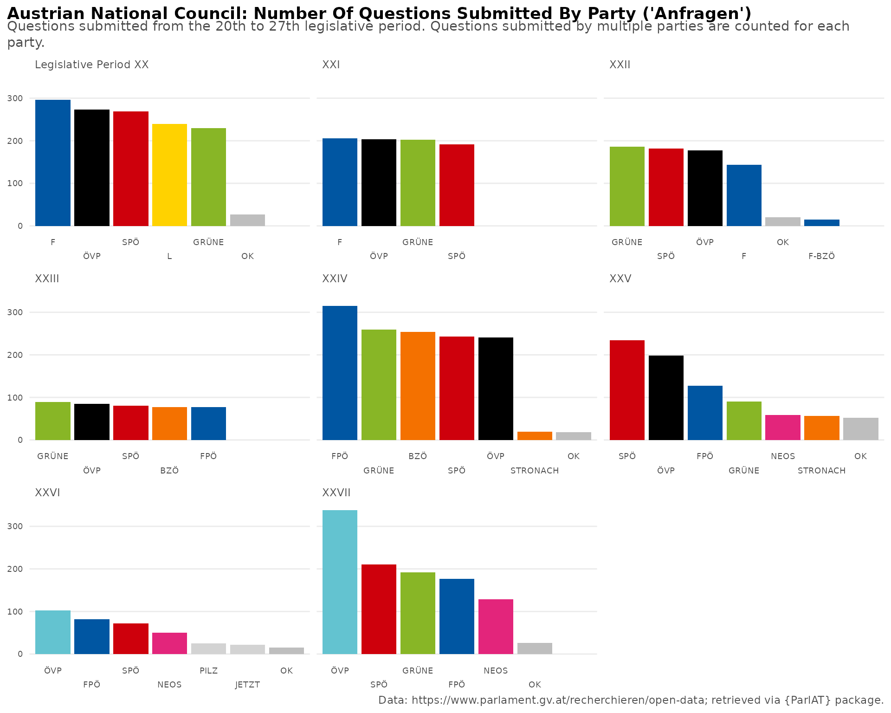
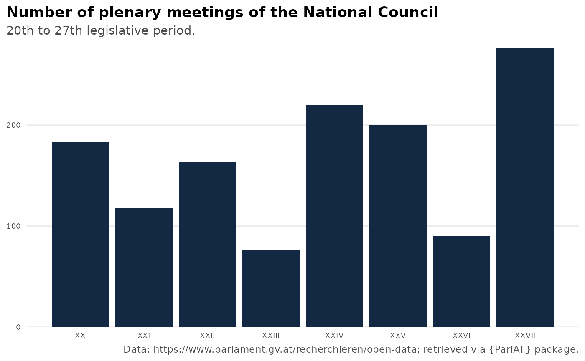

# ParlAT

This vignette provides an introduction on how to use the {ParlAT}
package to access and subseqently analyze open data provided by the
Austrian Parliament. Below are some examples which are meant to give a
general overview of the package’s functionality. For details, please
consult the [reference
section](https://werkstattcodes.github.io/ParlAT/dev/reference/index.md).

## Get current MPs in the National Council (Nationalrat)

Let’s start with retrieving the compostion of the National Council
(Nationalrat) at the time of writing (02 September 2026). This is done
by the function
[`get_mps_current()`](https://werkstattcodes.github.io/ParlAT/dev/reference/get_mps_current.md).

``` r

df_current <- get_mps_current(institution = "NR", echo=TRUE)
#> Results on the Parliament website: https://www.parlament.gv.at/recherchieren/personen/nationalrat/index.html?WFW_002M=M&WFW_002W=W
#> Hits: 183
#> ⠙ Fetching MPs' names 5/183 | ETA: 44s
#> 
#> ⠹ Fetching MPs' names 11/183 | ETA: 43s
#> 
#> ⠸ Fetching MPs' names 24/183 | ETA: 39s
#> 
#> ⠼ Fetching MPs' names 36/183 | ETA: 36s
#> 
#> ⠴ Fetching MPs' names 48/183 | ETA: 34s
#> 
#> ⠦ Fetching MPs' names 60/183 | ETA: 31s
#> 
#> ⠧ Fetching MPs' names 72/183 | ETA: 28s
#> 
#> ⠇ Fetching MPs' names 84/183 | ETA: 25s
#> 
#> ⠏ Fetching MPs' names 96/183 | ETA: 22s
#> 
#> ⠋ Fetching MPs' names 108/183 | ETA: 19s
#> 
#> ⠙ Fetching MPs' names 120/183 | ETA: 16s
#> 
#> ⠹ Fetching MPs' names 133/183 | ETA: 12s
#> 
#> ⠸ Fetching MPs' names 145/183 | ETA:  9s
#> 
#> ⠼ Fetching MPs' names 157/183 | ETA:  6s
#> 
#> ⠴ Fetching MPs' names 169/183 | ETA:  3s
#> 
#> ⠦ Fetching MPs' names 181/183 | ETA:  0s
#> 
#> Fetched 183 MPs' names.
nrow(df_current)
#> [1] 183

df_current %>%
count(party, sort=T)
#> # A tibble: 5 × 2
#>   party     n
#>   <chr> <int>
#> 1 FPÖ      57
#> 2 ÖVP      51
#> 3 SPÖ      41
#> 4 NEOS     18
#> 5 Grüne    16
```

If we want to get the composition of a chamber in the past, the function
[`get_mps()`](https://werkstattcodes.github.io/ParlAT/dev/reference/get_mps.md)
comes into play. It either returns all MPs of the requested chamber, who
formed part of it in the course of the entire legislative period
(`legis_period` argument), or at a specific date (`date` argument). The
latter is a convenient way to get the composition of the NR at a specifc
date.

Note that the `legis_period` filter is not applicable when searching MPs
of the Federal Council (Bundesrat). This limitation includes also
searches for MPs across all chambers.

``` r

#Search for all MPs in the National Council as of 1 January 2025
mps_01012025 <- get_mps(date="01.01.2025", institution="NR")
glimpse(mps_01012025)
#> Rows: 183
#> Columns: 7
#> $ date         <date> 2025-01-01, 2025-01-01, 2025-01-01, 2025-01-01, 2025-01-01, 2025-01-01, 2025-01-01, 2025-01-01, 2025-01-01, 2025-01-01, 2025-01-01, 2025-01-01, 2025-01-01, 2025-01-01, 2025-01-01, 2025-01-01, 2025-01-01, 2025-01-01, 2025-01-01, 2025-01-01, 2025-01-01, 2025-01-01, 2025-01-01, 2025-01-01, 2025-01-01, 2025-01-01, 2025-01-01, 2025-01-01, 2025-01-01, 2025-01-01, 2025-01-01, 2025-01-01, 2025-01-01, 2025-01-01, 2025-01-01, 2025-01-01, 2025-01-01, 2025-01-01, 2025-01-01, 2025-01-01, 2025-01-01, 2025-01-01, 2025-01-01, 2025-01-01, 2025-01-01, 2025-01-01, 2025-01-01, 2025-01-01, 2025-01-01, 2025-01-01, 2025-01-01, 2025-01-01, 2025-01-01, 2025-01-01, 2025-01-01, 2025-01-01, 2025-01-01, 2025-01-01, 2025-01-01, 2025-01-01, 2025-01-01, 2025-01-01, 2025-01-01, 2025-01-01, 2025-01-01, 2025-01-01, 2025-01-01, 2025-01-01, 2025-01-01, 2025-01-01, 2025-01-01, 2025-01-01, 2025-01-01, 2025-01-01, 2025-01-01, 2025-01-01, 2025-01-01, 2025-01-01, 2025-01-01, 2025-01-01, 2025-01-01, 2025-01-01, 2025-01-01, 2025-01-01, 2025-01-01, 2025-01-01, 2025-01-01, 2025-01-01, 2025-01-01, 2025-01-01, 2025-01-01, 2025-01-01, 2025-01-01, 2025-01-01, 2025-01-01, 2025-01-01, 2025-01-01, 2025-01-01, 2025-01-01, 2025-01-01, 2025-01-01, 2025-01-01, 2025-01-01, 2025-01-01, 2025-01-01, 2025-01-01, 2025-01-01, 2025-01-01, 2025-01-01, 2025-01-01, 2025-01-01, 2025-01-01, 2025-01-01, 2025-01-01, 2025-01-01, 2025-01-01, 2025-01-01, 2025-01-01, 2025-01-01, 2025-01-01, 2025-01-01, 2025-01-01, 2025-01-01, 2025-01-01, 2025-01-01, 2025-01-01, 2025-01-01, 2025-01-01, 2025-01-01, 2025-01-01, 2025-01-01, 2025-01-01, 2025-01-01, 2025-01-01, 2025-01-01, 2025-01-01, 2025-01-01, 2025-01-01, 2025-01-01, 2025-01-01, 2025-01-01, 2025-01-01, 2025-01-01, 2025-01-01, 2025-01-01, 2025-01-01, 2025-01-01, 2025-01-01, 2025-01-01, 2025-01-01, 2025-01-01, 2025-01-01, 2025-01-01, 2025-01-01, 2025-01-01, 2025-01-01, 2025-01-01, 2025-01-01, 2025-01-01, 2025-01-01, 2025-01-01, 2025-01-01, 2025-01-01, 2025-01-01, 2025-01-01, 2025-01-01, 2025-01-01, 2025-01-01, 2025-01-01, 2025-01-01, 2025-01-01, 2025-01-01, 2025-01-01, 2025-01-01, 2025-01-01, 2025-01-01, 2025-01-01, 2025-01-01, 2025-01-01, 2025-01-01, 2025-01-01, 2025-01-01, 2025-01-01
#> $ pad_intern   <int> 145, 1567, 1937, 1944, 1970, 1971, 1972, 1974, 1975, 1977, 1981, 1986, 1987, 2001, 2122, 2136, 2295, 2309, 2327, 2330, 2332, 2334, 2337, 2339, 2343, 2344, 2345, 2834, 2979, 2996, 2998, 3133, 3155, 3489, 3717, 5065, 5438, 5439, 5486, 5623, 5626, 5627, 5630, 5632, 5634, 5639, 5641, 5643, 5644, 5645, 5646, 5647, 5650, 5653, 5654, 5670, 5672, 5676, 5677, 5678, 5679, 5681, 5683, 5684, 5685, 5687, 6151, 6407, 6485, 6486, 6502, 6506, 8242, 10778, 12741, 14769, 14795, 14835, 14842, 14896, 16218, 16234, 20056, 20445, 22694, 22847, 23167, 23963, 25188, 30645, 30646, 30647, 30648, 30649, 30650, 30653, 30655, 30656, 30657, 30658, 30659, 30660, 30661, 30662, 30663, 30664, 30665, 30666, 30667, 30668, 30669, 30670, 30680, 30681, 30684, 30685, 30688, 30689, 30693, 30694, 30695, 30696, 30697, 30698, 30700, 30701, 30702, 30704, 30705, 30706, 30707, 30708, 30709, 30717, 30719, 30720, 30722, 30723, 30969, 31991, 35468, 35469, 35487, 35497, 35514, 35520, 35521, 35568, 36187, 47187, 51557, 51568, 51570, 51571, 51577, 52727, 55227, 61639, 64022, 65219, 67199, 72999, 78586, 80479, 83101, 83113, 83122, 83124, 83125, 83127, 83129, 83137, 83148, 83150, 83153, 83299, 83409, 84056, 86613, 87001, 87002, 87039, 91141
#> $ legis_period <chr> "XXVIII", "XXVIII", "XXVIII", "XXVIII", "XXVIII", "XXVIII", "XXVIII", "XXVIII", "XXVIII", "XXVIII", "XXVIII", "XXVIII", "XXVIII", "XXVIII", "XXVIII", "XXVIII", "XXVIII", "XXVIII", "XXVIII", "XXVIII", "XXVIII", "XXVIII", "XXVIII", "XXVIII", "XXVIII", "XXVIII", "XXVIII", "XXVIII", "XXVIII", "XXVIII", "XXVIII", "XXVIII", "XXVIII", "XXVIII", "XXVIII", "XXVIII", "XXVIII", "XXVIII", "XXVIII", "XXVIII", "XXVIII", "XXVIII", "XXVIII", "XXVIII", "XXVIII", "XXVIII", "XXVIII", "XXVIII", "XXVIII", "XXVIII", "XXVIII", "XXVIII", "XXVIII", "XXVIII", "XXVIII", "XXVIII", "XXVIII", "XXVIII", "XXVIII", "XXVIII", "XXVIII", "XXVIII", "XXVIII", "XXVIII", "XXVIII", "XXVIII", "XXVIII", "XXVIII", "XXVIII", "XXVIII", "XXVIII", "XXVIII", "XXVIII", "XXVIII", "XXVIII", "XXVIII", "XXVIII", "XXVIII", "XXVIII", "XXVIII", "XXVIII", "XXVIII", "XXVIII", "XXVIII", "XXVIII", "XXVIII", "XXVIII", "XXVIII", "XXVIII", "XXVIII", "XXVIII", "XXVIII", "XXVIII", "XXVIII", "XXVIII", "XXVIII", "XXVIII", "XXVIII", "XXVIII", "XXVIII", "XXVIII", "XXVIII", "XXVIII", "XXVIII", "XXVIII", "XXVIII", "XXVIII", "XXVIII", "XXVIII", "XXVIII", "XXVIII", "XXVIII", "XXVIII", "XXVIII", "XXVIII", "XXVIII", "XXVIII", "XXVIII", "XXVIII", "XXVIII", "XXVIII", "XXVIII", "XXVIII", "XXVIII", "XXVIII", "XXVIII", "XXVIII", "XXVIII", "XXVIII", "XXVIII", "XXVIII", "XXVIII", "XXVIII", "XXVIII", "XXVIII", "XXVIII", "XXVIII", "XXVIII", "XXVIII", "XXVIII", "XXVIII", "XXVIII", "XXVIII", "XXVIII", "XXVIII", "XXVIII", "XXVIII", "XXVIII", "XXVIII", "XXVIII", "XXVIII", "XXVIII", "XXVIII", "XXVIII", "XXVIII", "XXVIII", "XXVIII", "XXVIII", "XXVIII", "XXVIII", "XXVIII", "XXVIII", "XXVIII", "XXVIII", "XXVIII", "XXVIII", "XXVIII", "XXVIII", "XXVIII", "XXVIII", "XXVIII", "XXVIII", "XXVIII", "XXVIII", "XXVIII", "XXVIII", "XXVIII", "XXVIII", "XXVIII", "XXVIII", "XXVIII", "XXVIII", "XXVIII"
#> $ name         <chr> "Doris Bures", "Dr. Susanne Fürst", "Mag. Christian Ragger", "Peter Schmiedlechner", "Mag. Gerhard Kaniak", "Dipl.-Ing. Christian Schandor", "Dr. Markus Tschank", "Angela Baumgartner", "Mag. Dr. Juliane Bogner-Strauß", "Tanja Graf", "Mag. Carmen Jeitler-Cincelli, BA", "Dr. Gudrun Kugler", "Andreas Kühberger", "Ing. Klaus Lindinger, BSc", "Nico Marchetti", "Karl Nehammer, MSc", "Claudia Bauer", "Eva-Maria Holzleitner, BSc", "Christoph Stark", "Robert Laimer", "Christoph Zarits", "Mag.<sup>a</sup> Verena Nussbaum", "Sabine Schatz", "Mag. Selma Yildirim", "Douglas Hoyos-Trauttmansdorff", "Dr. Stephanie Krisper", "Dr. Alma Zadić, LL.M.", "Mag. Dr. Martin Graf", "Mag. Karoline Edtstadler", "Ricarda Berger", "Alois Kainz", "MMst. Mag. (FH) Maria Neumann", "Andrea Michaela Schartel", "Christoph Steiner", "Ing. Mag. Volker Reifenberger", "MMag. Dr. Michael Schilchegger", "Lukas Brandweiner", "Dr. Christian Stocker", "Laurenz Pöttinger", "Ing. Josef Hechenberger", "Andreas Minnich", "Carina Reiter", "Mst. Joachim Schnabel", "MMag. Dr. Agnes Totter, BEd", "Bettina Zopf", "Julia Elisabeth Herr", "Maximilian Köllner, MA", "Mag.<sup>a</sup> Dr.<sup>in</sup> Petra Oberrauner", "Alois Schroll", "Michael Seemayer", "Rudolf Silvan", "Petra Tanzler", "Mag. Meri Disoski", "Leonore Gewessler, BA", "Dr. Elisabeth Götze", "Mag. Markus Koza", "Barbara Neßler", "Ralph Schallmeiner", "Mag. Dr. Jakob Schwarz, BA", "Mag. Nina Tomaselli", "Dipl.-Ing. Olga Voglauer", "Süleyman Zorba", "Henrike Brandstötter", "Fiona Fiedler, BEd", "Mag. Martina von Künsberg Sarre", "Mag. Yannick Shetty", "Heike Eder, BSc MBA", "Markus Leinfellner", "Mag. Klaudia Tanner", "MMag. Dr. Susanne Raab", "Mag. Agnes Sirkka Prammer", "Mag. Romana Deckenbacher", "Mag. Werner Kogler", "Mag. Norbert Totschnig, MSc", "Peter Haubner", "Norbert Sieber", "August Wöginger", "Petra Bayr, MA MLS", "Kai Jan Krainer", "Mag. Elisabeth Scheucher-Pichler", "Martina Diesner-Wais", "Mst. Johann Höfinger, MBA", "Mag. (FH) Kurt Egger", "Mag. Gerhard Karner", "Mag. Jörg Leichtfried", "Thomas Spalt", "Christian Oxonitsch", "Andreas Babler, MSc", "MMag. Michaela Schmidt", "Tina Angela Berger", "Irene Eisenhut", "Michael Fürtbauer", "Mag. Marie-Christine Giuliani-Sterrer, BA", "Mag. Paul Hammerl, MA", "Elisabeth Heiß", "Melanie Erasim, MSc", "Dr. Barbara Kolm", "Manuel Litzke, BSc (WU)", "Reinhold Maier", "Michael Oberlechner, MA", "MMag. Alexander Petschnig", "Manuel Pfeifer", "Mag. Katayun Pracher-Hilander", "Christofer Ranzmaier", "Mag. Arnold Schiefer", "Mag. Harald Schuh", "Nicole Sunitsch", "Ing. Harald Thau", "Maximilian Weinzierl", "Mag. Gertraud Auinger-Oberzaucher", "Veit Valentin Dengler", "Johannes Gasser, BA Bakk. MSc", "MMag. Markus Hofer", "Dominik Oberhofer", "Mag. Christoph Pramhofer", "Mag. Sophie Marie Wotschke", "Mag. Katrin Auer", "Roland Baumann", "Reinhold Binder", "Mag. Antonio Della Rossa", "Andreas Haitzer", "Mag. Elke Hanel-Torsch", "Bernhard Herzog", "Mag. Heinrich Himmer", "Bernhard Höfler", "Franz Jantscher", "Wolfgang Kocevar", "Silvia Kumpan-Takacs, MSc BA", "Wolfgang Moitzi", "Mag. Manfred Sams", "Paul Stich", "Barbara Teiber, MA", "MMag. Pia Maria Wieninger", "Margreth Falkner", "Daniela Gmeinbauer", "Mag. Dr. Wolfgang Hattmannsdorfer", "Klaus Mair", "Mag. Harald Servus", "Sebastian Schwaighofer", "Albert Royer", "Dr. Dagmar Belakowitsch", "Mag. Gernot Darmann", "Gabriel Obernosterer", "Josef Muchitsch", "Wolfgang Zanger", "Herbert Kickl", "Ing. Norbert Hofer", "Mag. Norbert Nemeth", "Wendelin Mölzer", "Werner Herbert", "Dipl.-Ing. Gerhard Deimek", "Christian Lausch", "Dr. Walter Rosenkranz", "Mag. Harald Stefan", "Maximilian Linder", "Johannes Schmuckenschlager", "Mag. Michael Hammer", "Hermann Brückl, MA", "Michael Schnedlitz", "Mag. Lukas Hammer", "Mag. Wolfgang Gerstl", "Mag. Klaus Fürlinger", "Christian Hafenecker, MA", "Mag. Karin Greiner", "Sigrid Maurer, BA", "Philip Kucher", "Mag. Beate Meinl-Reisinger, MES", "Michael Bernhard", "Dr. Nikolaus Scherak, MA", "MMag. DDr. Hubert Fuchs", "MMMag. Dr. Axel Kassegger", "Peter Wurm", "Mag. Andreas Hanger", "Andreas Ottenschläger", "Dipl.-Ing. Georg Strasser", "Ing. Manfred Hofinger", "Mag. Ernst Gödl", "Josef Schellhorn", "Mario Lindner", "David Stögmüller", "Rosa Ecker, MBA", "Lisa Schuch-Gubik", "Dipl.-Ing. Karin Doppelbauer"
#> $ gender       <chr> "female", "female", "male", "male", "male", "male", "male", "female", "female", "female", "female", "female", "male", "male", "male", "male", "female", "female", "male", "male", "male", "female", "female", "female", "male", "female", "female", "male", "female", "female", "male", "female", "female", "male", "male", "male", "male", "male", "male", "male", "male", "female", "male", "female", "female", "female", "male", "female", "male", "male", "male", "female", "female", "female", "female", "male", "female", "male", "male", "female", "female", "male", "female", "female", "female", "male", "female", "male", "female", "female", "female", "female", "male", "male", "male", "male", "male", "female", "male", "female", "female", "male", "male", "male", "male", "male", "male", "male", "female", "female", "female", "male", "female", "male", "female", "female", "female", "male", "male", "male", "male", "male", "female", "male", "male", "male", "female", "male", "male", "female", "male", "male", "male", "male", "male", "female", "female", "male", "male", "male", "male", "female", "male", "male", "male", "male", "male", "female", "male", "male", "male", "female", "female", "female", "female", "male", "male", "male", "male", "male", "female", "male", "male", "male", "male", "male", "male", "male", "male", "male", "male", "male", "male", "male", "male", "male", "male", "male", "male", "male", "male", "male", "male", "female", "female", "male", "female", "male", "male", "male", "male", "male", "male", "male", "male", "male", "male", "male", "male", "male", "female", "female", "female"
#> $ link         <chr> "/person/145", "/person/1567", "/person/1937", "/person/1944", "/person/1970", "/person/1971", "/person/1972", "/person/1974", "/person/1975", "/person/1977", "/person/1981", "/person/1986", "/person/1987", "/person/2001", "/person/2122", "/person/2136", "/person/2295", "/person/2309", "/person/2327", "/person/2330", "/person/2332", "/person/2334", "/person/2337", "/person/2339", "/person/2343", "/person/2344", "/person/2345", "/person/2834", "/person/2979", "/person/2996", "/person/2998", "/person/3133", "/person/3155", "/person/3489", "/person/3717", "/person/5065", "/person/5438", "/person/5439", "/person/5486", "/person/5623", "/person/5626", "/person/5627", "/person/5630", "/person/5632", "/person/5634", "/person/5639", "/person/5641", "/person/5643", "/person/5644", "/person/5645", "/person/5646", "/person/5647", "/person/5650", "/person/5653", "/person/5654", "/person/5670", "/person/5672", "/person/5676", "/person/5677", "/person/5678", "/person/5679", "/person/5681", "/person/5683", "/person/5684", "/person/5685", "/person/5687", "/person/6151", "/person/6407", "/person/6485", "/person/6486", "/person/6502", "/person/6506", "/person/8242", "/person/10778", "/person/12741", "/person/14769", "/person/14795", "/person/14835", "/person/14842", "/person/14896", "/person/16218", "/person/16234", "/person/20056", "/person/20445", "/person/22694", "/person/22847", "/person/23167", "/person/23963", "/person/25188", "/person/30645", "/person/30646", "/person/30647", "/person/30648", "/person/30649", "/person/30650", "/person/30653", "/person/30655", "/person/30656", "/person/30657", "/person/30658", "/person/30659", "/person/30660", "/person/30661", "/person/30662", "/person/30663", "/person/30664", "/person/30665", "/person/30666", "/person/30667", "/person/30668", "/person/30669", "/person/30670", "/person/30680", "/person/30681", "/person/30684", "/person/30685", "/person/30688", "/person/30689", "/person/30693", "/person/30694", "/person/30695", "/person/30696", "/person/30697", "/person/30698", "/person/30700", "/person/30701", "/person/30702", "/person/30704", "/person/30705", "/person/30706", "/person/30707", "/person/30708", "/person/30709", "/person/30717", "/person/30719", "/person/30720", "/person/30722", "/person/30723", "/person/30969", "/person/31991", "/person/35468", "/person/35469", "/person/35487", "/person/35497", "/person/35514", "/person/35520", "/person/35521", "/person/35568", "/person/36187", "/person/47187", "/person/51557", "/person/51568", "/person/51570", "/person/51571", "/person/51577", "/person/52727", "/person/55227", "/person/61639", "/person/64022", "/person/65219", "/person/67199", "/person/72999", "/person/78586", "/person/80479", "/person/83101", "/person/83113", "/person/83122", "/person/83124", "/person/83125", "/person/83127", "/person/83129", "/person/83137", "/person/83148", "/person/83150", "/person/83153", "/person/83299", "/person/83409", "/person/84056", "/person/86613", "/person/87001", "/person/87002", "/person/87039", "/person/91141"
#> $ mp_details   <list> [<tbl_df[1 x 10]>], [<tbl_df[1 x 10]>], [<tbl_df[1 x 10]>], [<tbl_df[1 x 10]>], [<tbl_df[1 x 10]>], [<tbl_df[1 x 10]>], [<tbl_df[1 x 10]>], [<tbl_df[1 x 10]>], [<tbl_df[1 x 10]>], [<tbl_df[1 x 10]>], [<tbl_df[1 x 10]>], [<tbl_df[1 x 10]>], [<tbl_df[1 x 10]>], [<tbl_df[1 x 10]>], [<tbl_df[1 x 10]>], [<tbl_df[1 x 10]>], [<tbl_df[1 x 10]>], [<tbl_df[1 x 10]>], [<tbl_df[1 x 10]>], [<tbl_df[1 x 10]>], [<tbl_df[1 x 10]>], [<tbl_df[1 x 10]>], [<tbl_df[1 x 10]>], [<tbl_df[1 x 10]>], [<tbl_df[1 x 10]>], [<tbl_df[1 x 10]>], [<tbl_df[1 x 10]>], [<tbl_df[1 x 10]>], [<tbl_df[1 x 10]>], [<tbl_df[1 x 10]>], [<tbl_df[1 x 10]>], [<tbl_df[1 x 10]>], [<tbl_df[1 x 10]>], [<tbl_df[1 x 10]>], [<tbl_df[1 x 10]>], [<tbl_df[1 x 10]>], [<tbl_df[1 x 10]>], [<tbl_df[1 x 10]>], [<tbl_df[1 x 10]>], [<tbl_df[1 x 10]>], [<tbl_df[1 x 10]>], [<tbl_df[1 x 10]>], [<tbl_df[1 x 10]>], [<tbl_df[1 x 10]>], [<tbl_df[1 x 10]>], [<tbl_df[1 x 10]>], [<tbl_df[1 x 10]>], [<tbl_df[1 x 10]>], [<tbl_df[1 x 10]>], [<tbl_df[1 x 10]>], [<tbl_df[1 x 10]>], [<tbl_df[1 x 10]>], [<tbl_df[1 x 10]>], [<tbl_df[1 x 10]>], [<tbl_df[1 x 10]>], [<tbl_df[1 x 10]>], [<tbl_df[1 x 10]>], [<tbl_df[1 x 10]>], [<tbl_df[1 x 10]>], [<tbl_df[1 x 10]>], [<tbl_df[1 x 10]>], [<tbl_df[1 x 10]>], [<tbl_df[1 x 10]>], [<tbl_df[1 x 10]>], [<tbl_df[1 x 10]>], [<tbl_df[1 x 10]>], [<tbl_df[1 x 10]>], [<tbl_df[1 x 10]>], [<tbl_df[1 x 10]>], [<tbl_df[1 x 10]>], [<tbl_df[1 x 10]>], [<tbl_df[1 x 10]>], [<tbl_df[1 x 10]>], [<tbl_df[1 x 10]>], [<tbl_df[1 x 10]>], [<tbl_df[1 x 10]>], [<tbl_df[1 x 10]>], [<tbl_df[1 x 10]>], [<tbl_df[1 x 10]>], [<tbl_df[1 x 10]>], [<tbl_df[1 x 10]>], [<tbl_df[1 x 10]>], [<tbl_df[1 x 10]>], [<tbl_df[1 x 10]>], [<tbl_df[1 x 10]>], [<tbl_df[1 x 10]>], [<tbl_df[1 x 10]>], [<tbl_df[1 x 10]>], [<tbl_df[1 x 10]>], [<tbl_df[1 x 10]>], [<tbl_df[1 x 10]>], [<tbl_df[1 x 10]>], [<tbl_df[1 x 10]>], [<tbl_df[1 x 10]>], [<tbl_df[1 x 10]>], [<tbl_df[1 x 10]>], [<tbl_df[1 x 10]>], [<tbl_df[1 x 10]>], [<tbl_df[1 x 10]>], [<tbl_df[1 x 10]>], [<tbl_df[1 x 10]>], [<tbl_df[1 x 10]>], [<tbl_df[1 x 10]>], [<tbl_df[1 x 10]>], [<tbl_df[1 x 10]>], [<tbl_df[1 x 10]>], [<tbl_df[1 x 10]>], [<tbl_df[1 x 10]>], [<tbl_df[1 x 10]>], [<tbl_df[1 x 10]>], [<tbl_df[1 x 10]>], [<tbl_df[1 x 10]>], [<tbl_df[1 x 10]>], [<tbl_df[1 x 10]>], [<tbl_df[1 x 10]>], [<tbl_df[1 x 10]>], [<tbl_df[1 x 10]>], [<tbl_df[1 x 10]>], [<tbl_df[1 x 10]>], [<tbl_df[1 x 10]>], [<tbl_df[1 x 10]>], [<tbl_df[1 x 10]>], [<tbl_df[1 x 10]>], [<tbl_df[1 x 10]>], [<tbl_df[1 x 10]>], [<tbl_df[1 x 10]>], [<tbl_df[1 x 10]>], [<tbl_df[1 x 10]>], [<tbl_df[1 x 10]>], [<tbl_df[1 x 10]>], [<tbl_df[1 x 10]>], [<tbl_df[1 x 10]>], [<tbl_df[1 x 10]>], [<tbl_df[1 x 10]>], [<tbl_df[1 x 10]>], [<tbl_df[1 x 10]>], [<tbl_df[1 x 10]>], [<tbl_df[1 x 10]>], [<tbl_df[1 x 10]>], [<tbl_df[1 x 10]>], [<tbl_df[1 x 10]>], [<tbl_df[1 x 10]>], [<tbl_df[1 x 10]>], [<tbl_df[1 x 10]>], [<tbl_df[1 x 10]>], [<tbl_df[1 x 10]>], [<tbl_df[1 x 10]>], [<tbl_df[1 x 10]>], [<tbl_df[1 x 10]>], [<tbl_df[1 x 10]>], [<tbl_df[1 x 10]>], [<tbl_df[1 x 10]>], [<tbl_df[1 x 10]>], [<tbl_df[1 x 10]>], [<tbl_df[1 x 10]>], [<tbl_df[1 x 10]>], [<tbl_df[1 x 10]>], [<tbl_df[1 x 10]>], [<tbl_df[1 x 10]>], [<tbl_df[1 x 10]>], [<tbl_df[1 x 10]>], [<tbl_df[1 x 10]>], [<tbl_df[1 x 10]>], [<tbl_df[1 x 10]>], [<tbl_df[1 x 10]>], [<tbl_df[1 x 10]>], [<tbl_df[1 x 10]>], [<tbl_df[1 x 10]>], [<tbl_df[1 x 10]>], [<tbl_df[1 x 10]>], [<tbl_df[1 x 10]>], [<tbl_df[1 x 10]>], [<tbl_df[1 x 10]>], [<tbl_df[1 x 10]>], [<tbl_df[1 x 10]>], [<tbl_df[1 x 10]>], [<tbl_df[1 x 10]>], [<tbl_df[1 x 10]>], [<tbl_df[1 x 10]>], [<tbl_df[1 x 10]>], [<tbl_df[1 x 10]>], [<tbl_df[1 x 10]>], [<tbl_df[1 x 10]>]
```

`get_mps` returns one row per MP and legislative period. The list column
`mp_details` contains details on an MPs mandate during the relevant
legislative period. Since such details can change over the course of a
legislative period (e.g. party affiliation, electoral list of the
mandate), unnesting `mp_details` may result in more than one row per MP.
The example below reveals the changing

``` r

#get all MPs of the 22th legislative peiod
mps_legis22 <- get_mps(legis_period=22, institution="NR")
#> Results on the Parliament website: https://www.parlament.gv.at/recherchieren/personen/parlamentarierinnen-ab-1848/parlamentarierinnen-ab-1918?PERSON_409ATTR_JSON.mandate_detail.gremium_name=Nationalrat&PERSON_409ATTR_JSON.mandate_detail.gp_text_full_short=20.12.2002%20-%2029.10.2006:%20XXII.%20GP
#> Hits: 209

#unnest details on their mandats
mps_legis22 <- mps_legis22  %>%
    tidyr::unnest(mp_details)

#Example Scheibner during the 22th legislative period
mps_legis22 %>%
    dplyr::filter(stringr::str_detect(name, "Scheibner"))
#> # A tibble: 2 × 15
#>   pad_intern legis_period name              gender link         name_previous parl_group                          electoral_district_state electoral_district_region electoral_district_region_code chamber     chamber_code party                            mandate_date_start mandate_date_end
#>        <int> <chr>        <chr>             <chr>  <chr>        <chr>         <chr>                               <chr>                    <chr>                     <chr>                          <chr>       <chr>        <chr>                            <date>             <date>          
#> 1       1604 XXII         Herbert Scheibner male   /person/1604 NA            Freiheitlicher Parlamentsklub - BZÖ Wien                     Wien                      E9                             Nationalrat NR           Freiheitliche Partei Österreichs 2006-04-28         2006-10-29      
#> 2       1604 XXII         Herbert Scheibner male   /person/1604 NA            Freiheitlicher Parlamentsklub       Wien                     Wien                      E9                             Nationalrat NR           Freiheitliche Partei Österreichs 2002-12-20         2006-04-27
```

*Example Federal Council*

``` r

#Search for all MPs who were members of the Federal Council during the 25th legislative period:
#An error is returned since legis_period is no applicable filter for institution="BR".
df_mps_25_br <- get_mps(legis_period=25, institution="BR")
#> Error in `get_mps()`:
#> ! Filtering the Federal Council (Bundesrat) by legislative period is not supported. Please use 'date' filter instead.

#Get start and ending date of legislative period 25 with an auxilary function.
get_legis_periods(legis_period=25)
#>   legis_period_rom legis_period legis_period_current date_start   date_end                legis_period_name legis_period_abbrev legis_period_abbrev_num
#> 1              XXV           25                FALSE 2013-10-29 2017-11-08 29.10.2013 - 08.11.2017: XXV. GP                 XXV                      25

#Get members of the Federal Council as of 30 September 2013.
df_mps_25_br_date <- get_mps(date="30.10.2013", institution="BR")
nrow(df_mps_25_br_date)
#> [1] 60
```

## Get mandates

[`get_mandates()`](https://werkstattcodes.github.io/ParlAT/dev/reference/get_mandates.md)
returns all current and previous mandates of one or more individuals.
The function takes names as well as unique identifiers (`pad_intern`) as
inputs, with the latter being the more specific option.

``` r

#Example with MP names:
result <- get_mandates(name = c(
  "Karl Nehammer",
  "Andreas Babler"
))
dplyr::glimpse(result)
#> Rows: 9
#> Columns: 16
#> $ pad_intern                     <chr> "2136", "2136", "2136", "2136", "23963", "23963", "23963", "23963", "23963"
#> $ name                           <chr> "Karl Nehammer, MSc", "Karl Nehammer, MSc", "Karl Nehammer, MSc", "Karl Nehammer, MSc", "Andreas Babler, MSc", "Andreas Babler, MSc", "Andreas Babler, MSc", "Andreas Babler, MSc", "Andreas Babler, MSc"
#> $ position_text                  <chr> "Abgeordneter zum Nationalrat (XXVIII. GP), ÖVP", "Abgeordneter zum Nationalrat (XXVI.-XXVII. GP), ÖVP", "Bundeskanzler", "Bundesminister für Inneres", "Abgeordneter zum Nationalrat (XXVIII. GP), SPÖ", "Mitglied des Bundesrates, SPÖ", "Bundesminister für Wohnen, Kunst, Kultur, Medien und Sport", "Bundesminister für Kunst, Kultur, öffentlichen Dienst und Sport", "Vizekanzler"
#> $ position_code                  <chr> "NR", "NR", "BK", "BM", "NR", "BR", "BM", "BM", "VK"
#> $ position_name                  <chr> "Abgeordneter zum Nationalrat", "Abgeordneter zum Nationalrat", "Bundeskanzler", "Bundesminister für Inneres", "Abgeordneter zum Nationalrat", "Mitglied des Bundesrates", "Bundesminister für Wohnen, Kunst, Kultur, Medien und Sport", "Bundesminister für Kunst, Kultur, öffentlichen Dienst und Sport", "Vizekanzler"
#> $ position_date_start            <date> 2024-10-24, 2017-11-09, 2021-12-06, 2020-01-07, 2024-10-24, 2023-03-23, 2025-04-02, 2025-03-03, 2025-03-03
#> $ position_date_end              <date> 2025-01-21, 2020-01-07, 2025-01-10, 2021-12-06, 2025-03-06, 2024-10-23, NA, 2025-04-02, NA
#> $ position_active                <lgl> FALSE, FALSE, FALSE, FALSE, FALSE, FALSE, TRUE, FALSE, TRUE
#> $ parl_group                     <chr> "Parlamentsklub der Österreichischen Volkspartei", "Parlamentsklub der Österreichischen Volkspartei", NA, NA, "Die Sozialdemokratische Parlamentsfraktion - Klub der sozialdemokratischen Abgeordneten zum Nationalrat, Bundesrat und Europäischen Parlament", "Bundesratsfraktion der SPÖ", NA, NA, NA
#> $ party                          <chr> "ÖVP", "ÖVP", NA, NA, "SPÖ", "SPÖ", NA, NA, NA
#> $ party_name                     <chr> "Österreichische Volkspartei", "Österreichische Volkspartei", NA, NA, "Sozialdemokratische Partei Österreichs", "Sozialdemokratische Partei Österreichs", NA, NA, NA
#> $ substitute                     <chr> NA, NA, NA, NA, NA, NA, NA, NA, NA
#> $ electoral_district_region_code <chr> "FB", "FB", NA, NA, "FB", "In", NA, NA, NA
#> $ electoral_district_region      <chr> "Bundeswahlvorschlag", "Bundeswahlvorschlag", NA, NA, "Bundeswahlvorschlag", "In den Bundesrat entsendet vom Niederösterreichischen Landtag", NA, NA, NA
#> $ legis_period                   <list> "XXVIII", <"XXVI", "XXVII">, <>, <>, "XXVIII", <>, <>, <>, <>
#> $ url_biography                  <chr> "https://www.parlament.gv.at/person/2136", "https://www.parlament.gv.at/person/2136", "https://www.parlament.gv.at/person/2136", "https://www.parlament.gv.at/person/2136", "https://www.parlament.gv.at/person/23963", "https://www.parlament.gv.at/person/23963", "https://www.parlament.gv.at/person/23963", "https://www.parlament.gv.at/person/23963", "https://www.parlament.gv.at/person/23963"

#Example with pad_intern and auxiliary function `get_pad_intern`.
result <- get_pad_intern("Peter Pilz")
dplyr::glimpse(result)
#> Rows: 1
#> Columns: 2
#> $ pad_intern     <chr> "1210"
#> $ names_variants <chr> "Peter Pilz"

result <- get_mandates(pad_intern=1210)
dplyr::glimpse(result)
#> Rows: 5
#> Columns: 16
#> $ pad_intern                     <chr> "1210", "1210", "1210", "1210", "1210"
#> $ name                           <chr> "Dr. Peter Pilz", "Dr. Peter Pilz", "Dr. Peter Pilz", "Dr. Peter Pilz", "Dr. Peter Pilz"
#> $ position_text                  <chr> "Abgeordneter zum Nationalrat (XXVI. GP), JETZT", "Abgeordneter zum Nationalrat (XXVI. GP), PILZ", "Abgeordneter zum Nationalrat (XXV. GP), ohne Klubzugehörigkeit", "Abgeordneter zum Nationalrat (XXI.-XXV. GP), GRÜNE", "Abgeordneter zum Nationalrat (XVII.-XVIII. GP), GRÜNE"
#> $ position_code                  <chr> "NR", "NR", "NR", "NR", "NR"
#> $ position_name                  <chr> "Abgeordneter zum Nationalrat", "Abgeordneter zum Nationalrat", "Abgeordneter zum Nationalrat", "Abgeordneter zum Nationalrat", "Abgeordneter zum Nationalrat"
#> $ position_date_start            <date> 2018-11-20, 2018-06-08, 2017-07-17, 1999-10-29, 1986-12-17
#> $ position_date_end              <date> 2019-10-22, 2018-11-19, 2017-11-08, 2017-07-16, 1991-12-08
#> $ position_active                <lgl> FALSE, FALSE, FALSE, FALSE, FALSE
#> $ parl_group                     <chr> "Parlamentsklub JETZT", "Liste Pilz", "ohne Klubzugehörigkeit", "Der Grüne Klub im Parlament - Klub der Grünen Abgeordneten zum Nationalrat, Bundesrat und Europäischen Parlament", "Der Grüne Klub - Klub der Grün-Alternativen Abgeordneten"
#> $ party                          <chr> "JETZT", "PILZ", "OK", "GRÜNE", "GRÜNE"
#> $ party_name                     <chr> "Liste Peter Pilz", "Liste Peter Pilz", "Die Grünen", "Die Grünen", "Die Grünen"
#> $ substitute                     <chr> NA, NA, NA, NA, NA
#> $ electoral_district_region_code <chr> "FB", "FB", "FB", "FB", "Wahlkreisverband"
#> $ electoral_district_region      <chr> "Bundeswahlvorschlag", "Bundeswahlvorschlag", "Bundeswahlvorschlag", "Bundeswahlvorschlag", "Wahlkreisverband II (K, OÖ, S, St, T u V)"
#> $ legis_period                   <list> "XXVI", "XXVI", "XXV", <"XXI", "XXV">, <"XVII", "XVIII">
#> $ url_biography                  <chr> "https://www.parlament.gv.at/person/1210", "https://www.parlament.gv.at/person/1210", "https://www.parlament.gv.at/person/1210", "https://www.parlament.gv.at/person/1210", "https://www.parlament.gv.at/person/1210"
```

The function `get_mandates` also allows us to relatively easily
calcualte the total number of days which the current MPs in the National
Council have been serving as of now, and identify the longest serving
MPs (top 5 are shown below).

``` r

df_mandates <- get_mandates(pad_intern=df_current$pad_intern, institution = "NR")
#> ⠙ Fetching mandates 9/183 | ETA: 22s
#> ⠹ Fetching mandates 13/183 | ETA: 22s
#> ⠸ Fetching mandates 34/183 | ETA: 21s
#> ⠼ Fetching mandates 55/183 | ETA: 18s
#> ⠴ Fetching mandates 76/183 | ETA: 15s
#> ⠦ Fetching mandates 97/183 | ETA: 12s
#> ⠧ Fetching mandates 118/183 | ETA:  9s
#> ⠇ Fetching mandates 140/183 | ETA:  6s
#> ⠏ Fetching mandates 158/183 | ETA:  4s
#> ⠋ Fetching mandates 179/183 | ETA:  1s
#> Fetched mandates for 183 persons.
#> 

#keep only MP mandates in the National Council (NR); `instituiton` refers only to the 
#current position, not the preceding mandates.
df_mandates <- df_mandates %>%
    filter(position_code == "NR") 
  
df_mandates <- df_mandates %>%
mutate(position_date_end=case_when(
  is.na(position_date_end) & position_active==TRUE ~ lubridate::today(),
  .default=position_date_end
)) %>%
mutate(position_duration_days = as.numeric(difftime(position_date_end, position_date_start, units = "days")),
.after=position_date_end)

duration <- df_mandates %>%
summarise(position_days_sum=sum(position_duration_days), .by=c("pad_intern", "name")) %>%
arrange(desc(position_days_sum))

duration %>%
slice_head(., n=5)
#> # A tibble: 5 × 3
#>   pad_intern name                 position_days_sum
#>   <chr>      <chr>                            <dbl>
#> 1 145        Doris Bures                      10498
#> 2 12741      Peter Haubner                     9039
#> 3 2834       Mag. Dr. Martin Graf              8738
#> 4 14835      Petra Bayr, MA MLS                8657
#> 5 14795      August Wöginger                   8657
```

## Get MPs’ details

If we are interested in the work of a specific MP, the fucntion
[`get_mps_details()`](https://werkstattcodes.github.io/ParlAT/dev/reference/get_mps_details.md)
is the tool of choice. There are three detail types which can be quried:
“plenary” (Plenum), “committee” (Ausschüsse), and “activities”
(Aktivitäten).

For a start, let’s get a list of all speeches held in the plenary by MP
Karlheinz Kopf. To get his required pad_intern, we can resort to the
auxilary function ‘get_pad_intern()’ which returns the MP’s unique
identifier.

``` r

#get pad_intern of Karlheinz Kopf
get_pad_intern("Karlheinz Kopf")
#> # A tibble: 1 × 2
#>   pad_intern names_variants
#>   <chr>      <chr>         
#> 1 2822       Karlheinz Kopf

#get all statements held in the plenary of the National Council by Karlheinz Kopf
df_plenary_kopf <- get_mps_details(pad_intern=2822, detail_type="plenary", institution = "NR")
#> Results on the Parliament website: https://www.parlament.gv.at/person/2822?BIO_250PAD_INTERN=2822&BIO_250GREMIUM=N&selectedtab=PLENUM
#> Hits: 380


df_plenary_kopf %>%
  count(legis_period) %>%
  arrange(legis_period)
#> # A tibble: 9 × 2
#>   legis_period     n
#>   <chr>        <int>
#> 1 XIX              1
#> 2 XX              62
#> 3 XXI             44
#> 4 XXII            56
#> 5 XXIII           26
#> 6 XXIV           105
#> 7 XXV              4
#> 8 XXVI            18
#> 9 XXVII           64
```

Note that `get_mps_details` returns all activites, speeches even if the
individual was member of the government bench or member of the houses
presidency at this point in time. The column `position_name` is a list
column containing all mandates the indiviudal held *in the relevant
house* at the time of the plenary statement.

``` r

#Example Sebastian Kurz: statements held by Sebastian Kurz in the plenary of the National Council.
#Note different positions.

get_pad_intern("Sebastian Kurz")
#> # A tibble: 1 × 2
#>   pad_intern names_variants
#>   <chr>      <chr>         
#> 1 65321      Sebastian Kurz

df_plenary_kurz <- get_mps_details(pad_intern=65321, detail_type="plenary", institution = "NR") 
#> Results on the Parliament website: https://www.parlament.gv.at/person/65321?BIO_250PAD_INTERN=65321&BIO_250GREMIUM=N&selectedtab=PLENUM
#> Hits: 76

df_plenary_kurz %>%
unnest(position_name) %>%
count(position_name, sort=TRUE)
#> # A tibble: 5 × 2
#>   position_name                                                         n
#>   <chr>                                                             <int>
#> 1 Bundeskanzler                                                        41
#> 2 Bundesminister für Europa, Integration und Äußeres                   25
#> 3 Staatssekretär im Bundesministerium für Inneres                       6
#> 4 Abgeordneter zum Nationalrat                                          5
#> 5 Bundesminister für europäische und internationale Angelegenheiten     1
```

## Items under consideration (‘Verhandlungsgegenstände’)

The ability to search for different items under consideration is
probably one of the most encompassing features offered by the Open Data
repository of the Austrian Parliament (see
[here](https://www.parlament.gv.at/recherchieren/gegenstaende/index.html?FP_001NRBR=NR)).
The items which can be queried comprise a wide range including Topical
Debates (*Aktuelle Stunden*), Inquiries (*Anfragen*), Government Bills
(*Regierungsvorlagen*) etc. All items can be accessed via the general
[`get_items()`](https://werkstattcodes.github.io/ParlAT/dev/reference/get_items.md)
function. For a full list of available items see
[here](https://werkstattcodes.github.io/ParlAT/dev/reference/get_items.html#item-gegenstand-).

For some of these items, additional parameter(s) are available to
further specifiy the query. E.g. the item “ANTR” (Anträge, Motions)
allows for the specification of the type of motion via the `type_doc`
attribute. For details see the reference section
[here](https://werkstattcodes.github.io/ParlAT/dev/reference/get_items.html#doc-type-art-des-antrages-).

*Example: Inquiries (Anfragen)*

Below, as an example, let’s query all written and oral questions
(*Anfragen*) from the 20 to the 27 legislative period (for the relevant
item abbreviations see the function reference), and subsequently
visualise the count by party and legislative period.

``` r

#get items
df_items <- get_items(item = "J_JPR_M", legis_period = seq(20,27), echo=TRUE)
#> ℹ Fetching items from API...
#> ✔ Fetched 77208 items
#> Results on the Parliament website: https://www.parlament.gv.at/recherchieren/gegenstaende?FP_001GP_CODE=XX&FP_001GP_CODE=XXI&FP_001GP_CODE=XXII&FP_001GP_CODE=XXIII&FP_001GP_CODE=XXIV&FP_001GP_CODE=XXV&FP_001GP_CODE=XXVI&FP_001GP_CODE=XXVII&FP_001VHG=J_JPR_M
#> Hits: 77208


dplyr::glimpse(df_items %>% head())
#> Rows: 6
#> Columns: 16
#> $ legis_period     <chr> "XXVII", "XXVII", "XXVII", "XXVII", "XXVII", "XXVII"
#> $ institution      <chr> "NR", "NR", "NR", "NR", "NR", "NR"
#> $ date             <date> 2024-10-14, 2024-10-14, 2024-10-14, 2024-10-08, 2024-10-03, 2024-10-01
#> $ item_type        <chr> "J", "J", "J", "J", "J", "JPR"
#> $ item_number      <chr> "19510", "19509", "19508", "19507", "19506", "101"
#> $ item_number_type <chr> "19510/J", "19509/J", "19508/J", "19507/J", "19506/J", "101/JPR"
#> $ stage            <chr> "3", "3", "3", "3", "5", "5"
#> $ item_url         <chr> "https://www.parlament.gv.at/gegenstand/XXVII/J/19510", "https://www.parlament.gv.at/gegenstand/XXVII/J/19509", "https://www.parlament.gv.at/gegenstand/XXVII/J/19508", "https://www.parlament.gv.at/gegenstand/XXVII/J/19507", "https://www.parlament.gv.at/gegenstand/XXVII/J/19506", "https://www.parlament.gv.at/gegenstand/XXVII/JPR/101"
#> $ type_doc         <chr> "J", "J", "J", "J", "J", "JPR"
#> $ type_doc_long    <chr> "Schriftliche Anfrage", "Schriftliche Anfrage", "Schriftliche Anfrage", "Schriftliche Anfrage", "Schriftliche Anfrage", "Schriftliche Anfrage an Präsidentin/Präsident/Ausschussvorsitzende"
#> $ subject          <chr> "Steckt ukrainischer Verein hinter organisierter Beschädigung von FPÖ-Plakaten? - Frist für die Beantwortung 14.12.2024", "Linksextreme Chaoten attackieren FPÖ-Wahlfeier - Frist für die Beantwortung 14.12.2024", "Verbot des sportlichen Long-Range-Schießens für den Heeressportverein - Frist für die Beantwortung 14.12.2024", "Botschafter Michael Linhart als ÖVP-Wahlkampfhelfer bei der Vorarlberger Landtagswahl - Frist für die Beantwortung 08.12.2024", "Zustände in der Justizanstalt Salzburg - beantwortet durch 18818/AB", "Willkürlicher Ausschluss von Journalisten von der Wahlberichterstattung aus dem Parlament - beantwortet durch 100/ABPR"
#> $ topics           <list> <"Inneres und Recht", "Parlament und Demokratie", "Soziales">, <"Inneres und Recht", "Parlament und Demokratie", "Soziales">, <"Inneres und Recht", "Landesverteidigung", "Soziales", "Sport">, <"Außenpolitik", "Inneres und Recht", "Parlament und Demokratie">, "Inneres und Recht", <"Information und Medien", "Parlament und Demokratie">
#> $ keywords         <list> <"Vereins- und Versammlungsrecht", "Politische Parteien", "Wahlen">, <"Sicherheitswesen", "Abgeordnete", "Nationalrat V. Sonstiges", "Öffentlicher Dienst", "Vereins- und Versammlungsrecht">, <"Vereins- und Versammlungsrecht", "Landesverteidigung", "Sport">, <"Wahlen", "Bundesländer", "Völkerrechtliche Vertretungen">, <"Strafrecht", "Öffentlicher Dienst">, <"Nationalrat V. Sonstiges", "Presse", "Wahlen">
#> $ eurovoc          <chr> "[\"Politische Partei\",\"Vereinsleben\",\"Versammlungsfreiheit\",\"Wahl\"]", "[\"direkt gewählte Kammer\",\"öffentliche Sicherheit\",\"öffentliche Verwaltung\",\"öffentlicher Dienst\",\"Parlamentarier\",\"Vereinsleben\",\"Versammlungsfreiheit\"]", "[\"Sport\",\"Vereinsleben\",\"Versammlungsfreiheit\",\"Verteidigung\"]", "[\"diplomatische Beziehungen\",\"Gliedstaat\",\"Wahl\"]", "[\"öffentliche Verwaltung\",\"öffentlicher Dienst\",\"Strafrecht\"]", "[\"direkt gewählte Kammer\",\"Presse\",\"Wahl\"]"
#> $ persons          <list> <"20445", "78586">, <"20445", "78586">, <"3717", "6485">, <"5430", "5678">, <"2345", "3717">, <"78586", "88386">
#> $ parl_group       <list> "FPÖ", "FPÖ", "FPÖ", "GRÜNE", "FPÖ", "FPÖ"
```

There were in total 77 208 questions submitted in writing and asked
orally by the members of the National Council from the 20th to 27th
legislative period. With a few additional steps, we can easily visualise
the results.

``` r

#aggregate result; account for changing ÖVP party colors
df_plot <- df_items %>%
  unnest_longer(parl_group) %>%
  count(legis_period, parl_group) %>%
  mutate(
    parl_group_color = get_party_colors(parl_group, legis_period)
  )  

#plot
df_plot %>%
  ggplot()+
  labs(
    title = stringr::str_to_title("Austrian National Council: Number of questions submitted by party ('Anfragen')"),
    subtitle = "Questions submitted from the 20th to 27th legislative period. Questions submitted by multiple parties are counted for each party.",
    caption = "Data: https://www.parlament.gv.at/recherchieren/open-data; retrieved via {ParlAT} package."
  )+
  geom_bar(aes(x=tidytext::reorder_within(parl_group, -n, legis_period), y=n, fill=parl_group_color), stat="identity")+ 
  scale_x_reordered(guide = guide_axis(n.dodge = 2), continuous.limits=c(1,7))+
  scale_y_continuous(labels=scales::label_number(big.mark = ".", decimal.mark = ","))+  
  scale_fill_identity()+
  facet_wrap(vars(legis_period), scales = "free_x", labeller = labeller(legis_period = function(x) ifelse(x == min(x), paste("Legislative Period", x), x)))+ 
  theme_minimal()+
  theme(
    strip.text.x= element_text(face = "plain", hjust = 0,color="grey30"),
    panel.grid.minor =  element_blank(),
    panel.grid.major.x=  element_blank(),
    legend.position = "none",
    axis.title.x = element_blank(),
    axis.text.x=element_text(size=rel(0.8)),
    axis.text.y=element_text(size=rel(0.8)),
    axis.title.y=element_blank(),
    plot.caption = element_text(color="grey30", size=rel(.8)),
    plot.subtitle=ggtext::element_textbox_simple(color="grey30", margin = ggplot2::margin(b = 10)),
    plot.title.position = "plot",
    plot.title = element_text(face = "bold")
  )
```



*Example: Government Bills (“Regierungsvorlagen”)*

As another example to demonstrate the power of the
[`get_items()`](https://werkstattcodes.github.io/ParlAT/dev/reference/get_items.md)
function, let’s get the number of government bills tabled from the 20th
to the 27th legislative period and count them. Furthermore, making use
of the `topic` column, which is returned by the API, one can easily
differentiate between the bills’ various topical foci and obtain the
pertaining subtotals.

``` r

df_govBills <- get_items(item = "RV", legis_period = seq(20,27)) 
#> ℹ Fetching items from API...
#> ✔ Fetched 2593 items
#> Results on the Parliament website: https://www.parlament.gv.at/recherchieren/gegenstaende?FP_001GP_CODE=XX&FP_001GP_CODE=XXI&FP_001GP_CODE=XXII&FP_001GP_CODE=XXIII&FP_001GP_CODE=XXIV&FP_001GP_CODE=XXV&FP_001GP_CODE=XXVI&FP_001GP_CODE=XXVII&FP_001VHG=RV
#> Hits: 2593

glimpse(df_govBills %>% head())
#> Rows: 6
#> Columns: 16
#> $ legis_period     <chr> "XXVII", "XXVII", "XXVII", "XXVII", "XXVII", "XXVII"
#> $ institution      <chr> "NR", "NR", "NR", "NR", "NR", "NR"
#> $ date             <date> 2024-07-05, 2024-06-12, 2024-06-12, 2024-06-12, 2024-06-12, 2024-06-12
#> $ item_type        <chr> "I", "I", "I", "I", "I", "I"
#> $ item_number      <chr> "2704", "2609", "2607", "2606", "2600", "2596"
#> $ item_number_type <chr> "2704 d.B.", "2609 d.B.", "2607 d.B.", "2606 d.B.", "2600 d.B.", "2596 d.B."
#> $ stage            <chr> "2", "5", "5", "5", "5", "5"
#> $ item_url         <chr> "https://www.parlament.gv.at/gegenstand/XXVII/I/2704", "https://www.parlament.gv.at/gegenstand/XXVII/I/2609", "https://www.parlament.gv.at/gegenstand/XXVII/I/2607", "https://www.parlament.gv.at/gegenstand/XXVII/I/2606", "https://www.parlament.gv.at/gegenstand/XXVII/I/2600", "https://www.parlament.gv.at/gegenstand/XXVII/I/2596"
#> $ type_doc         <chr> "RV", "RV", "RV", "RV", "RV", "RV"
#> $ type_doc_long    <chr> "Regierungsvorlage: Bundes(verfassungs)gesetz", "Regierungsvorlage: Bundes(verfassungs)gesetz", "Regierungsvorlage: Bundes(verfassungs)gesetz", "Regierungsvorlage: Bundes(verfassungs)gesetz", "Regierungsvorlage: Bundes(verfassungs)gesetz", "Regierungsvorlage: Bundes(verfassungs)gesetz"
#> $ subject          <chr> "Bundeshaushaltsgesetzes 2013, Änderung", "Zivildienstgesetz, Änderung", "Sozialversicherungs-Änderungsgesetz 2024 – SVÄG 2024", "Grundbuchs-Novelle 2024 – GB-Nov 2024", "IFI Beitragsgesetz 2024", "DORA-Vollzugsgesetz (DORA-VG); Alternative Investmentfonds Manager-Gesetz, Bankwesengesetz u.a., Änderung"
#> $ topics           <list> "Budget und Finanzen", "Landesverteidigung", "Soziales", "Inneres und Recht", <"Außenpolitik", "Budget und Finanzen">, <"Budget und Finanzen", "Information und Medien">
#> $ keywords         <list> "Bundeshaushalt III. Sonstiges", "Zivildienst", "Sozialversicherung I. Allgemeine Sozialversicherung", "Zivilrecht", <"Kreditwesen", "Entwicklungszusammenarbeit">, <"Kreditwesen", "Information und Informationsverarbeitung", "Vertragsversicherungen">
#> $ eurovoc          <chr> "[\"Öffentliche Finanzen und Haushaltspolitik\"]", "[\"Zivildienst\"]", "[\"soziale Sicherheit\"]", "[\"Bürgerliches Recht\"]", "[\"Finanzwesen\",\"Politik der Zusammenarbeit\"]", "[\"Finanzwesen\",\"Informatik\",\"Information und Informationsverarbeitung\",\"Versicherungswesen\"]"
#> $ persons          <list> "55727", "2136", "21029", "2345", "55727", "55727"
#> $ parl_group       <list> "", "", "", "", "", ""

#count number of bills by legis period
df_govBills %>%
count(legis_period, name = "n") 
#>   legis_period   n
#> 1           XX 443
#> 2          XXI 291
#> 3         XXII 374
#> 4        XXIII 176
#> 5         XXIV 496
#> 6          XXV 331
#> 7         XXVI 117
#> 8        XXVII 365

df_govBillsTopicsTop5 <- df_govBills %>%
unnest_longer(topics) %>%
group_by(legis_period) %>%
mutate(topics=forcats::fct_lump_n(topics, n = 5, ties.method = "first")) %>%
ungroup() %>%
count(legis_period, topics)

df_govBillsTopicsTop5 %>%
filter(topics!="Other") %>%
ggplot()+
labs(
  title="Austrian Parliament: Number of tabled government bills by topic",
  subtitle="Top-5 topics per frequency and legilslative period. 20th to 27th legislative period. A bill with multiple topics is counted in \neach topic category.",
  caption = "Data: https://www.parlament.gv.at/recherchieren/open-data; retrieved via ParlAT package."
)+ 
geom_bar(
  aes(y=tidytext::reorder_within(topics, n, legis_period), 
  x=n,
  fill=topics),
  stat="identity")+
scale_y_reordered()+
scale_x_continuous(
  expand=expansion(mult=c(0,.1))
)+
scale_fill_viridis_d()+
facet_wrap(
  vars(legis_period), 
  labeller = labeller(legis_period = function(value) ifelse(value == min(value), paste("GP", value), value)),
  scales="free_y")+
theme_minimal()+
theme(
    strip.text.x= element_text(face = "plain", hjust = 0, color="grey30"),
    panel.grid.minor =  element_blank(),
    panel.grid.major.y=  element_blank(),
    legend.position = "none",
    axis.title.x = element_blank(),
    axis.text.x=element_text(size=rel(0.8)),
    axis.text.y=element_text(size=rel(0.8)),
    axis.title.y=element_blank(),
    plot.caption = element_text(color="grey30"),
    plot.subtitle=ggtext::element_textbox_simple(color="grey30", margin = ggplot2::margin(b = 15)),
    plot.title.position = "plot",
    plot.title = element_text(face = "bold")
  )
```


*Example: Popular Initiatives (“Volksbegehren”)*

Get the number of popular initiatives (“Volksbegehren”) which were
considered - in different stages - by the Austrian National Counil from
the 20th to the 27th legislative period and count them per legislative
period.

``` r

df_petition <- get_items(item = "VOLKBG", legis_period = seq(20, 27), institution = "NR", echo = TRUE)
#> ℹ Fetching items from API...
#> ✔ Fetched 65 items
#> Results on the Parliament website: https://www.parlament.gv.at/recherchieren/gegenstaende?FP_001NRBR=NR&FP_001GP_CODE=XX&FP_001GP_CODE=XXI&FP_001GP_CODE=XXII&FP_001GP_CODE=XXIII&FP_001GP_CODE=XXIV&FP_001GP_CODE=XXV&FP_001GP_CODE=XXVI&FP_001GP_CODE=XXVII&FP_001VHG=VOLKBG
#> Hits: 65
df_petition %>% count(legis_period)
#>   legis_period  n
#> 1           XX  6
#> 2          XXI  6
#> 3         XXII  3
#> 4         XXIV  2
#> 5          XXV  2
#> 6         XXVI  3
#> 7        XXVII 43
```

## Get data on Plenary Meetings

What to know how often the National Council had plenary meetings? The
function `get_plenary_meetings` returns this and releated meta data
starting from the 20th legislative period.

``` r


df_meetings_20_27 <- get_plenary_meetings(institution = "NR", legis_period = seq(20,27), meeting_and_activities = "meetings", echo=TRUE)
#> Results on the Parliament website: https://www.parlament.gv.at/recherchieren/plenarsitzungen?PLENAR_701GREMIUM=NR&PLENAR_701SIAKT=SI&PLENAR_701GP_CODE=XX&PLENAR_701GP_CODE=XXI&PLENAR_701GP_CODE=XXII&PLENAR_701GP_CODE=XXIII&PLENAR_701GP_CODE=XXIV&PLENAR_701GP_CODE=XXV&PLENAR_701GP_CODE=XXVI&PLENAR_701GP_CODE=XXVII
#> Fetching 27 pages...
#> Hits: 1327

df_meetings_20_27 %>%
  count(legis_period) %>%
  mutate(legis_period=as.integer(legis_period)) %>%
  ggplot() + 
  labs(
    title="Number of plenary meetings of the National Council",
    subtitle="20th to 27th legislative period.",
    caption = "Data: https://www.parlament.gv.at/recherchieren/open-data; retrieved via {ParlAT} package."
  )+
  geom_bar(aes(x=legis_period, y=n), stat="identity", fill="#132943")+
  scale_y_continuous(expand = expansion(mult = c(0, 0)))+ 
  scale_x_continuous(
    breaks = 20:27,
    labels = function(x) as.character(as.roman(x))
  )+
  theme_minimal()+
  theme(
    strip.text.x= element_text(face = "plain", hjust = 0,color="grey30"),
    panel.grid.minor =  element_blank(),
    panel.grid.major.x=  element_blank(),
    legend.position = "none",
    axis.title.x = element_blank(),
    axis.text.x=element_text(size=rel(0.8)),
    axis.text.y=element_text(size=rel(0.8)),
    axis.title.y=element_blank(),
    plot.caption = element_text(color="grey30", size=rel(.8)),
    plot.subtitle=ggtext::element_textbox_simple(color="grey30", margin = ggplot2::margin(b = 10)),
    plot.title.position = "plot",
    plot.title = element_text(face = "bold")
  )
```



## Get data on committees

Which committees of the National Council were active during the 27th
legisative period:

``` r

committesNR27 <- get_committees(legis_period=27, institution="NR")
dplyr::glimpse(committesNR27)
#> Rows: 43
#> Columns: 5
#> $ legis_period  <chr> "XXVII", "XXVII", "XXVII", "XXVII", "XXVII", "XXVII", "XXVII", "XXVII", "XXVII", "XXVII", "XXVII", "XXVII", "XXVII", "XXVII", "XXVII", "XXVII", "XXVII", "XXVII", "XXVII", "XXVII", "XXVII", "XXVII", "XXVII", "XXVII", "XXVII", "XXVII", "XXVII", "XXVII", "XXVII", "XXVII", "XXVII", "XXVII", "XXVII", "XXVII", "XXVII", "XXVII", "XXVII", "XXVII", "XXVII", "XXVII", "XXVII", "XXVII", "XXVII"
#> $ committee     <chr> "Ausschuss für Arbeit und Soziales", "Außenpolitischer Ausschuss", "Ausschuss für Bauten und Wohnen", "Budgetausschuss", "Ständiger Unterausschuss des Budgetausschusses", "Ständiger Unterausschuss in ESM-Angelegenheiten", "Ausschuss für Familie und Jugend", "Finanzausschuss", "Ausschuss für Forschung, Innovation und Digitalisierung", "Geschäftsordnungsausschuss", "Gesundheitsausschuss", "Gleichbehandlungsausschuss", "Hauptausschuss", "Ständiger Unterausschuss des Hauptausschusses", "Ständiger Unterausschuss in Angelegenheiten der Europäischen Union", "Immunitätsausschuss", "Ausschuss für innere Angelegenheiten", "Ständiger Unterausschuss des Ausschusses für innere Angelegenheiten", "Justizausschuss", "Ausschuss für Konsumentenschutz", "Kulturausschuss", "Landesverteidigungsausschuss", "Ständiger Unterausschuss des Landesverteidigungsausschusses", "Ausschuss für Land- und Forstwirtschaft", "Ausschuss für Menschenrechte", "Ausschuss für Petitionen und Bürgerinitiativen", "Rechnungshofausschuss", "Ständiger Unterausschuss des Rechnungshofausschusses", "Sportausschuss", "Tourismusausschuss", "Umweltausschuss", "Unterrichtsausschuss", "Unvereinbarkeitsausschuss", "Verfassungsausschuss", "Verkehrsausschuss", "Volksanwaltschaftsausschuss", "Ausschuss für Wirtschaft, Industrie und Energie", "Wissenschaftsausschuss", "Ständiger gemeinsamer Ausschuss im Sinne des § 9 des Finanz-Verfassungsgesetzes 1948", "Ibiza-Untersuchungsausschuss eingesetzt am 22.01.2020 - beendet am 22.09.2021", "\"ROT-BLAUER Machtmissbrauch-Untersuchungsausschuss\" eingesetzt am 15.12.2023 - beendet am 03.07.2024", "COFAG-Untersuchungsausschuss eingesetzt am 15.12.2023 - beendet am 03.07.2024", "ÖVP-Korruptions-Untersuchungsausschuss eingesetzt am 09.12.2021 - beendet am 27.04.2023"
#> $ citation      <chr> "A-AS/1", "A-AU/1", "A-BA/1", "A-BU/1", "SA-BU/1", "SA-ESM/1", "A-FA/1", "A-FI/1", "A-FO/1", "A-GO/1", "A-GE/1", "A-GL/1", "A-HA/1", "SA-HA/1", "SA-EU/1", "A-IM/1", "A-IA/1", "SA-IA/1", "A-JU/1", "A-KO/1", "A-KU/1", "A-LV/1", "SA-LV/1", "A-LF/1", "A-ME/1", "A-PB/1", "A-RH/1", "SA-RH/1", "A-SP/1", "A-TO/1", "A-UM/1", "A-UN/1", "A-UV/1", "A-VF/1", "A-VE/1", "A-VO/1", "A-WH/1", "A-WI/1", "SA-P9/1", "A-USA/2", "A-USA/5", "A-USA/4", "A-USA/3"
#> $ id_number     <int> 883, 884, 885, 867, 874, 875, 886, 887, 888, 873, 889, 890, 868, 869, 870, 872, 877, 878, 891, 892, 882, 879, 880, 893, 894, 895, 881, 905, 896, 897, 898, 899, 871, 900, 901, 902, 903, 904, 876, 906, 906, 906, 906
#> $ url_committee <chr> "https://www.parlament.gv.at/ausschuss/XXVII/A-AS/1/00883", "https://www.parlament.gv.at/ausschuss/XXVII/A-AU/1/00884", "https://www.parlament.gv.at/ausschuss/XXVII/A-BA/1/00885", "https://www.parlament.gv.at/ausschuss/XXVII/A-BU/1/00867", "https://www.parlament.gv.at/ausschuss/XXVII/SA-BU/1/00874", "https://www.parlament.gv.at/ausschuss/XXVII/SA-ESM/1/00875", "https://www.parlament.gv.at/ausschuss/XXVII/A-FA/1/00886", "https://www.parlament.gv.at/ausschuss/XXVII/A-FI/1/00887", "https://www.parlament.gv.at/ausschuss/XXVII/A-FO/1/00888", "https://www.parlament.gv.at/ausschuss/XXVII/A-GO/1/00873", "https://www.parlament.gv.at/ausschuss/XXVII/A-GE/1/00889", "https://www.parlament.gv.at/ausschuss/XXVII/A-GL/1/00890", "https://www.parlament.gv.at/ausschuss/XXVII/A-HA/1/00868", "https://www.parlament.gv.at/ausschuss/XXVII/SA-HA/1/00869", "https://www.parlament.gv.at/ausschuss/XXVII/SA-EU/1/00870", "https://www.parlament.gv.at/ausschuss/XXVII/A-IM/1/00872", "https://www.parlament.gv.at/ausschuss/XXVII/A-IA/1/00877", "https://www.parlament.gv.at/ausschuss/XXVII/SA-IA/1/00878", "https://www.parlament.gv.at/ausschuss/XXVII/A-JU/1/00891", "https://www.parlament.gv.at/ausschuss/XXVII/A-KO/1/00892", "https://www.parlament.gv.at/ausschuss/XXVII/A-KU/1/00882", "https://www.parlament.gv.at/ausschuss/XXVII/A-LV/1/00879", "https://www.parlament.gv.at/ausschuss/XXVII/SA-LV/1/00880", "https://www.parlament.gv.at/ausschuss/XXVII/A-LF/1/00893", "https://www.parlament.gv.at/ausschuss/XXVII/A-ME/1/00894", "https://www.parlament.gv.at/ausschuss/XXVII/A-PB/1/00895", "https://www.parlament.gv.at/ausschuss/XXVII/A-RH/1/00881", "https://www.parlament.gv.at/ausschuss/XXVII/SA-RH/1/00905", "https://www.parlament.gv.at/ausschuss/XXVII/A-SP/1/00896", "https://www.parlament.gv.at/ausschuss/XXVII/A-TO/1/00897", "https://www.parlament.gv.at/ausschuss/XXVII/A-UM/1/00898", "https://www.parlament.gv.at/ausschuss/XXVII/A-UN/1/00899", "https://www.parlament.gv.at/ausschuss/XXVII/A-UV/1/00871", "https://www.parlament.gv.at/ausschuss/XXVII/A-VF/1/00900", "https://www.parlament.gv.at/ausschuss/XXVII/A-VE/1/00901", "https://www.parlament.gv.at/ausschuss/XXVII/A-VO/1/00902", "https://www.parlament.gv.at/ausschuss/XXVII/A-WH/1/00903", "https://www.parlament.gv.at/ausschuss/XXVII/A-WI/1/00904", "https://www.parlament.gv.at/ausschuss/XXVII/SA-P9/1/00876", "https://www.parlament.gv.at/ausschuss/XXVII/A-USA/2/00906", "https://www.parlament.gv.at/ausschuss/XXVII/A-USA/5/00906", "https://www.parlament.gv.at/ausschuss/XXVII/A-USA/4/00906", "https://www.parlament.gv.at/ausschuss/XXVII/A-USA/3/00906"
```

How many committees of inquiry (Untersuchungsausschüsse) have there been
over the different legislative period (API returns data from 20
legisative period onward):

``` r

result <- get_committees(legis_period="XXVIII", citation="USA", institution="NR")
dplyr::glimpse(result)
#> Rows: 1
#> Columns: 5
#> $ legis_period  <chr> "XXVIII"
#> $ committee     <chr> "Pilnacek-Untersuchungsausschuss eingesetzt am 22.10.2025"
#> $ citation      <chr> "A-USA/2"
#> $ id_number     <int> 944
#> $ url_committee <chr> "https://www.parlament.gv.at/ausschuss/XXVIII/A-USA/2/00944"

committeeInquiry <- map(seq(20,28,1), \(x) get_committees(legis_period=x, institution="NR", citation="USA")) %>% list_rbind()
committeeInquiry %>%
  dplyr::mutate(legis_period = factor(legis_period, levels = as.character(as.roman(20:28)))) %>%
  dplyr::count(legis_period, .drop=F)
#> # A tibble: 9 × 2
#>   legis_period     n
#>   <fct>        <int>
#> 1 XX               0
#> 2 XXI              1
#> 3 XXII             0
#> 4 XXIII            3
#> 5 XXIV             2
#> 6 XXV              2
#> 7 XXVI             2
#> 8 XXVII            4
#> 9 XXVIII           1
```

Additional details on a committee can be retrieved by specifying the
attribute `details_type`. As of now, `members` is the only available
option. Member information is automatically unnested into the result.

``` r

committeeIbiza <- get_committees(legis_period=27, search_string="Ibiza", institution="NR", details_type="members")
dplyr::glimpse(committeeIbiza)
#> Rows: 1
#> Columns: 10
#> $ legis_period  <chr> "XXVII"
#> $ committee     <chr> "Ibiza-Untersuchungsausschuss eingesetzt am 22.01.2020 - beendet am 22.09.2021"
#> $ citation      <chr> "A-USA/2"
#> $ id_number     <int> 906
#> $ url_committee <chr> "https://www.parlament.gv.at/ausschuss/XXVII/A-USA/2/00906"
#> $ date_start    <dttm> 2020-01-22
#> $ date_end      <dttm> 2024-10-23
#> $ url_pdf       <chr> "/dokument/XXVII/A-USA/2/00906/MIT_00906.pdf"
#> $ url_html      <chr> "/dokument/XXVII/A-USA/2/00906/MIT_00906.html"
#> $ members       <list> [<tbl_df[39 x 4]>]
```

## Get names & pad_interns

`get_names` is an auxiliary function to get an MP’s different names (due
to marriage, divorce, or other reasons). Below an example with MP Pia
Pilippa Beck, ex Strache.

``` r

#get first the pad_intern of the MP
result <- get_pad_intern("Strache")
dplyr::glimpse(result)
#> Rows: 3
#> Columns: 2
#> $ pad_intern     <chr> "1905", "35518", "44127"
#> $ names_variants <chr> "Max Strache", "Heinz-Christian Strache", "Pia Philippa Beck, Pia Philippa Strache"

#get all name variants
result <- get_names(pad_intern=44127)
dplyr::glimpse(result)
#> Rows: 2
#> Columns: 9
#> $ index       <int> 1, 2
#> $ pad_intern  <chr> "44127", "44127"
#> $ name        <chr> "Pia Philippa Beck", "Pia Philippa Strache"
#> $ date_start  <date> 2023-06-28, NA
#> $ date_end    <date> NA, 2023-06-27
#> $ name_clean  <chr> "Pia Philippa Beck", "Pia Philippa Strache"
#> $ name_family <chr> "Beck", "Strache"
#> $ name_given  <chr> "Pia Philippa ", "Pia Philippa "
#> $ note        <chr> NA, "(bis 27.6.2023: Pia Philippa Strache)"
```

Providing a date, returns the applicable name at the specified date.

``` r

result <- get_names(44127, date = "01/01/2024")
dplyr::glimpse(result)
#> Rows: 1
#> Columns: 9
#> $ index       <int> 1
#> $ pad_intern  <chr> "44127"
#> $ name        <chr> "Pia Philippa Beck"
#> $ date_start  <date> 2023-06-28
#> $ date_end    <date> NA
#> $ name_clean  <chr> "Pia Philippa Beck"
#> $ name_family <chr> "Beck"
#> $ name_given  <chr> "Pia Philippa "
#> $ note        <chr> NA
```

## Miscellaneous

The *echo argument*: Whenever relevant and feasible, ParlAT functions
provide the option to echo the query to the API. The echo prints the
query’s search arguments as well as the resulting URL to the console.
The latter links to the same results on the website of the Austrian
Parliament. The echo argument was included to double-check the results,
facilitate convenient sharing of queries, and provide an additional
avenue to explore the data.

\`\`\`
